# KX Event Tracking System

A dual-package TypeScript monorepo for event tracking with AWS CDK infrastructure and runtime decorators.

## 📦 Packages

### `@toldyaonce/kx-events-decorators`
Runtime decorators and helpers for event tracking in Lambda functions.

### `kx-events-cdk`
CDK constructs for provisioning AWS infrastructure including VPC, RDS PostgreSQL, SQS, and consumer Lambda. **Note: This package provides the database infrastructure only - no API Gateway or query endpoints are included by design.**

**✅ Cross-Environment Support**: All resources are created with explicit physical names and CloudFormation exports to enable cross-stack referencing without "cross-environment" errors.

## 🏗️ Architecture

### High-Level Data Flow

```mermaid
graph TD
    A["🚀 Lambda Function<br/>@EventTracking Decorator"] --> B["📬 SQS Standard Queue<br/>events-queue"]
    B --> C["⚡ Consumer Lambda<br/>Node.js 18.x"]
    C --> D["🗄️ PostgreSQL RDS<br/>events table"]
    C --> F["🌉 EventBridge Custom Bus<br/>Real-time event distribution"]
    B --> E["💀 Dead Letter Queue<br/>Failed messages"]
    F --> G["🎯 Event Consumers<br/>Rules & Targets"]
    
    style A fill:#ff9900,stroke:#232f3e,stroke-width:2px,color:#fff
    style B fill:#ff4b4b,stroke:#232f3e,stroke-width:2px,color:#fff
    style C fill:#ff9900,stroke:#232f3e,stroke-width:2px,color:#fff
    style D fill:#336791,stroke:#232f3e,stroke-width:2px,color:#fff
    style E fill:#8b0000,stroke:#232f3e,stroke-width:2px,color:#fff
    style F fill:#ff6b35,stroke:#232f3e,stroke-width:2px,color:#fff
    style G fill:#4CAF50,stroke:#232f3e,stroke-width:2px,color:#fff
```


### AWS Infrastructure Overview

```mermaid
graph TB
    subgraph "🌐 VPC (Multi-AZ)"
        subgraph "🔓 Public Subnets"
            NAT["🌍 NAT Gateway"]
        end
        
        subgraph "🔒 Private Subnets"
            LAMBDA["⚡ Consumer Lambda<br/>📦 VPC Enabled<br/>🔐 Security Groups"]
            RDS["🗄️ RDS PostgreSQL 15<br/>🔐 Private Access Only<br/>🗝️ Secrets Manager"]
        end
    end
    
    subgraph "☁️ AWS Managed Services"
        SQS["📬 SQS Queue + DLQ<br/>🔄 Batch Processing<br/>⏱️ 5min Visibility"]
        EB["🌉 EventBridge Custom Bus<br/>🎯 Event Rules & Routing<br/>🔄 Real-time Distribution"]
        SECRETS["🗝️ Secrets Manager<br/>🔐 DB Credentials<br/>🔄 Auto Rotation"]
        CW["📊 CloudWatch<br/>📈 Metrics & Logs<br/>🚨 Alarms"]
    end
    
    subgraph "🔧 Your Custom API (Optional)"
        API["🌐 API Gateway<br/>🔐 Your Security Rules"]
        QUERY["⚡ Query Lambda<br/>📊 Custom Endpoints"]
    end
    
    USER["👤 Your Lambda Functions<br/>@EventTracking"] --> SQS
    SQS --> LAMBDA
    LAMBDA --> RDS
    LAMBDA --> EB
    LAMBDA --> SECRETS
    LAMBDA --> CW
    RDS --> SECRETS
    
    API --> QUERY
    QUERY --> RDS
    QUERY --> SECRETS
    
    subgraph "🎯 Event Consumers (Your Apps)"
        CONSUMER1["⚡ Consumer Lambda 1<br/>📧 Email Notifications"]
        CONSUMER2["⚡ Consumer Lambda 2<br/>📊 Analytics Pipeline"]
        CONSUMER3["⚡ Consumer Lambda 3<br/>🔔 Push Notifications"]
    end
    
    EB --> CONSUMER1
    EB --> CONSUMER2
    EB --> CONSUMER3
    
    style USER fill:#4CAF50,stroke:#232f3e,stroke-width:3px,color:#fff
    style SQS fill:#ff4b4b,stroke:#232f3e,stroke-width:2px,color:#fff
    style LAMBDA fill:#ff9900,stroke:#232f3e,stroke-width:2px,color:#fff
    style RDS fill:#336791,stroke:#232f3e,stroke-width:2px,color:#fff
    style EB fill:#ff6b35,stroke:#232f3e,stroke-width:2px,color:#fff
    style SECRETS fill:#dd344c,stroke:#232f3e,stroke-width:2px,color:#fff
    style CW fill:#ff9900,stroke:#232f3e,stroke-width:2px,color:#fff
    style NAT fill:#ff9900,stroke:#232f3e,stroke-width:2px,color:#fff
    style CONSUMER1 fill:#4CAF50,stroke:#232f3e,stroke-width:2px,color:#fff
    style CONSUMER2 fill:#4CAF50,stroke:#232f3e,stroke-width:2px,color:#fff
    style CONSUMER3 fill:#4CAF50,stroke:#232f3e,stroke-width:2px,color:#fff
```


### Event Processing Flow

```mermaid
sequenceDiagram
    participant App as 🚀 Your Lambda
    participant Dec as 🎯 @EventTracking
    participant SQS as 📬 SQS Queue
    participant Con as ⚡ Consumer
    participant DB as 🗄️ PostgreSQL
    participant EB as 🌉 EventBridge
    participant Consumers as 🎯 Event Consumers
    participant DLQ as 💀 Dead Letter Queue

    App->>Dec: Execute handler
    Dec->>App: ✅ Handler succeeds
    Dec->>Dec: 🔍 Extract clientId
    Dec->>Dec: 🆔 Generate eventId
    Dec->>SQS: 📤 Publish TrackedEvent
    Note over Dec,SQS: Fire-and-forget<br/>Logs errors, never throws
    
    SQS->>Con: 📥 Batch delivery (1-10 msgs)
    Con->>Con: ✅ Validate event schema
    Con->>DB: 🔍 ON CONFLICT DO NOTHING
    Con->>DB: 💾 INSERT event
    Con->>EB: 🌉 Publish to EventBridge
    Note over Con,EB: After successful RDS insertion<br/>Fire-and-forget
    
    EB->>Consumers: 🎯 Route to matching rules
    Note over EB,Consumers: Real-time event distribution<br/>Multiple consumers possible
    
    alt Processing Fails
        Con->>SQS: ❌ Message not deleted
        SQS->>SQS: 🔄 Retry (max 3 times)
        SQS->>DLQ: 💀 Send to DLQ
    end
```


### Security & IAM Flow


## 🌉 EventBridge Integration

The KX Event Tracking system now includes **dual persistence**: events are stored in RDS for reliable querying **and** published to EventBridge for real-time event distribution to multiple consumers.

### Architecture Benefits

- **🗄️ Reliable Storage**: RDS provides ACID transactions and complex querying
- **🌉 Real-time Distribution**: EventBridge enables immediate event routing to multiple consumers
- **🎯 Flexible Routing**: Use EventBridge rules to route specific events to different targets
- **🔄 Decoupled Architecture**: Consumers don't need direct database access
- **📈 Scalable**: EventBridge handles high-throughput event distribution

### Event Flow

1. **Your Lambda** → Publishes to SQS (via `@EventTracking` decorator)
2. **Consumer Lambda** → Stores in RDS → Publishes to EventBridge
3. **EventBridge** → Routes events to your consumer applications based on rules

### EventBridge Event Format

Events published to EventBridge follow this structure:

```json
{
  "Source": "kx-event-tracking",
  "DetailType": "{entityType}.{eventType}",
  "Detail": {
    "eventId": "550e8400-e29b-41d4-a716-446655440000",
    "clientId": "client_123",
    "previousEventId": "event_456",
    "userId": "user_789",
    "entityId": "entity_123",
    "entityType": "user",
    "eventType": "user_created",
    "source": "api",
    "campaignId": "campaign_456",
    "pointsAwarded": 100,
    "sessionId": "session_789",
    "occurredAt": "2024-01-15T10:30:00.000Z",
    "metadata": {
      "userAgent": "Mozilla/5.0...",
      "ipAddress": "192.168.1.1"
    }
  },
  "Time": "2024-01-15T10:30:00.000Z"
}
```

### Service Discovery

The EventBridge custom bus is registered in AWS Systems Manager Parameter Store for easy discovery:

```bash
# Get EventBridge ARN by service name
aws ssm get-parameter --name "/eventbridge/services/kx-event-tracking/arn"

# Get full service info
aws ssm get-parameter --name "/eventbridge/services/kx-event-tracking/info"
```

## 🎯 Creating Event Consumers

### CDK-based Consumer

```typescript
import * as cdk from 'aws-cdk-lib';
import * as events from 'aws-cdk-lib/aws-events';
import * as targets from 'aws-cdk-lib/aws-events-targets';
import { NodejsFunction } from 'aws-cdk-lib/aws-lambda-nodejs';
import { EventTrackingStack } from '@toldyaonce/kx-events-cdk';

export class MyEventConsumerStack extends cdk.Stack {
  constructor(scope: cdk.App, id: string, props?: cdk.StackProps) {
    super(scope, id, props);

    // Import EventBridge from the event tracking stack
    const eventBridge = events.EventBus.fromEventBusArn(
      this,
      'KxEventBridge',
      cdk.Fn.importValue('EventTrackingStack-EventBridgeArn')
    );

    // Create your consumer Lambda
    const emailNotificationLambda = new NodejsFunction(this, 'EmailNotificationFunction', {
      entry: 'src/lambdas/email-notifications/index.ts',
      environment: {
        SMTP_HOST: process.env.SMTP_HOST!,
        SMTP_USER: process.env.SMTP_USER!,
      },
    });

    // Create EventBridge rule to consume user events
    new events.Rule(this, 'UserEventsRule', {
      eventBus: eventBridge,
      eventPattern: {
        source: ['kx-event-tracking'],
        detailType: ['user.user_created', 'user.user_updated'],
        detail: {
          clientId: ['client_123'], // Optional: filter by specific client
        },
      },
      targets: [new targets.LambdaFunction(emailNotificationLambda)],
    });

    // Create rule for payment events
    new events.Rule(this, 'PaymentEventsRule', {
      eventBus: eventBridge,
      eventPattern: {
        source: ['kx-event-tracking'],
        detailType: ['payment.payment_completed'],
      },
      targets: [new targets.LambdaFunction(emailNotificationLambda)],
    });
  }
}
```

### Serverless Framework Consumer

```yaml
# serverless.yml
service: my-event-consumer

custom:
  # Import EventBridge ARN from CloudFormation exports
  eventBridgeArn: ${cf:EventTrackingStack.EventBridgeArn}

functions:
  emailNotifications:
    handler: src/handlers/emailNotifications.handler
    events:
      - eventBridge:
          eventBus: ${self:custom.eventBridgeArn}
          pattern:
            source: ['kx-event-tracking']
            detail-type: ['user.user_created', 'user.user_updated']

  analyticsProcessor:
    handler: src/handlers/analytics.handler
    events:
      - eventBridge:
          eventBus: ${self:custom.eventBridgeArn}
          pattern:
            source: ['kx-event-tracking']
            detail-type: ['qr.qr.get', 'payment.payment_completed']
            detail:
              pointsAwarded: [{ "exists": true }] # Only events with points
```

### Consumer Lambda Handler

```typescript
// src/handlers/emailNotifications.ts
import { EventBridgeEvent, Context } from 'aws-lambda';

interface KxTrackedEvent {
  eventId: string;
  clientId: string;
  userId?: string;
  entityType: string;
  eventType: string;
  occurredAt: string;
  metadata?: Record<string, any>;
}

export const handler = async (
  event: EventBridgeEvent<string, KxTrackedEvent>,
  context: Context
) => {
  console.log('Received event:', JSON.stringify(event, null, 2));

  const { detail: trackedEvent } = event;
  
  try {
    switch (event['detail-type']) {
      case 'user.user_created':
        await sendWelcomeEmail(trackedEvent);
        break;
        
      case 'user.user_updated':
        await sendProfileUpdateNotification(trackedEvent);
        break;
        
      case 'payment.payment_completed':
        await sendPaymentConfirmation(trackedEvent);
        break;
        
      default:
        console.log('Unhandled event type:', event['detail-type']);
    }
    
    console.log('Successfully processed event:', trackedEvent.eventId);
  } catch (error) {
    console.error('Failed to process event:', error);
    throw error; // This will cause EventBridge to retry
  }
};

async function sendWelcomeEmail(event: KxTrackedEvent) {
  console.log('Sending welcome email for user:', event.userId);
  // Your email sending logic here
}

async function sendProfileUpdateNotification(event: KxTrackedEvent) {
  console.log('Sending profile update notification for user:', event.userId);
  // Your notification logic here
}

async function sendPaymentConfirmation(event: KxTrackedEvent) {
  console.log('Sending payment confirmation for client:', event.clientId);
  // Your payment confirmation logic here
}
```

### Cross-Region Event Consumers

```typescript
// Consumer in different region
export class CrossRegionConsumerStack extends cdk.Stack {
  constructor(scope: cdk.App, id: string, props?: cdk.StackProps) {
    super(scope, id, props);

    // Import EventBridge from different region
    const eventBridge = events.EventBus.fromEventBusArn(
      this,
      'KxEventBridge',
      'arn:aws:events:us-east-1:123456789012:event-bus/kx-event-tracking-events-bus'
    );

    // Create cross-region rule
    new events.Rule(this, 'CrossRegionRule', {
      eventBus: eventBridge,
      eventPattern: {
        source: ['kx-event-tracking'],
        detailType: ['user.user_created'],
      },
      targets: [
        new targets.SqsQueue(myQueue), // Send to SQS in this region
        new targets.LambdaFunction(myLambda), // Or invoke Lambda directly
      ],
    });
  }
}
```

### Event Filtering Examples

```typescript
// Filter by client ID
eventPattern: {
  source: ['kx-event-tracking'],
  detailType: ['user.user_created'],
  detail: {
    clientId: ['client_123', 'client_456'], // Multiple clients
  },
}

// Filter by event source
eventPattern: {
  source: ['kx-event-tracking'],
  detail: {
    source: ['api'], // Only API events, not worker events
  },
}

// Filter by points awarded
eventPattern: {
  source: ['kx-event-tracking'],
  detail: {
    pointsAwarded: [{ "numeric": [">", 0] }], // Only events with points
  },
}

// Filter by metadata
eventPattern: {
  source: ['kx-event-tracking'],
  detail: {
    metadata: {
      campaign: ['holiday-2024'], // Specific campaign
    },
  },
}

// Complex filtering
eventPattern: {
  source: ['kx-event-tracking'],
  detailType: [{ "prefix": "user." }], // All user events
  detail: {
    clientId: ['client_123'],
    source: ['api', 'worker'],
    pointsAwarded: [{ "exists": true }],
  },
}
```

## 🚀 Quick Start

### 1. Install Packages

```bash
npm install @toldyaonce/kx-events-decorators @toldyaonce/kx-events-cdk
```

### 2. Deploy Infrastructure

**Basic Usage (Recommended):**
```typescript
import { EventTrackingStack } from '@toldyaonce/kx-events-cdk';
import * as cdk from 'aws-cdk-lib';

const app = new cdk.App();
const eventsStack = new EventTrackingStack(app, 'EventTrackingStack');

// Access resources after creation
console.log(eventsStack.database.instance); // RDS instance
console.log(eventsStack.database.secret);   // Secrets Manager secret
console.log(eventsStack.vpc);               // VPC instance
```

**As Nested Stack:**
```typescript
import { EventTrackingStack } from '@toldyaonce/kx-events-cdk';
import * as cdk from 'aws-cdk-lib';
import { NodejsFunction } from 'aws-cdk-lib/aws-lambda-nodejs';

export class MyAppStack extends cdk.Stack {
  constructor(scope: cdk.App, id: string, props?: cdk.StackProps) {
    super(scope, id, props);
    
    // Create event tracking infrastructure as nested stack
    const eventsStack = new EventTrackingStack(this, 'Events', {
      resourcePrefix: 'myapp', // Optional: customize resource names
    });
    
    // Use the resources in your application
    const myLambda = new NodejsFunction(this, 'MyFunction', {
      entry: 'src/handlers/inline-handler.ts', // Move inline code to separate file;'),
      vpc: eventsStack.vpc, // Use the same VPC for network connectivity
      vpcSubnets: {
        subnetType: cdk.aws_ec2.SubnetType.PRIVATE_WITH_EGRESS,
      },
      environment: {
        DB_SECRET_ARN: eventsStack.database.secret.secretArn,
        EVENTS_QUEUE_URL: eventsStack.eventsBus.queue.queueUrl,
      },
    });
    
    // Grant permissions
    eventsStack.database.secret.grantRead(myLambda);
    eventsStack.eventsBus.queue.grantSendMessages(myLambda);
    
    // Allow your Lambda to connect to the database
    eventsStack.database.securityGroup.addIngressRule(
      myLambda.connections.securityGroups[0],
      cdk.aws_ec2.Port.tcp(5432),
      'Allow MyFunction to connect to events database'
    );
  }
}

// Deploy the nested stack
const app = new cdk.App();
new MyAppStack(app, 'MyAppStack', {
  env: {
    account: process.env.CDK_DEFAULT_ACCOUNT,
    region: process.env.CDK_DEFAULT_REGION,
  },
});
```

**With Custom Resource Names:**
```typescript
const eventsStack = new EventTrackingStack(app, 'EventTrackingStack', {
  resourcePrefix: 'my-app',
  vpcName: 'my-app-vpc',
  databaseName: 'events',
  secretName: 'my-app-db-secret',
  queueName: 'my-app-events-queue',
  functionName: 'my-app-events-consumer',
});
```

### 3. Use in Your Lambda Functions

```typescript
import { EventTracking } from '@toldyaonce/kx-events-decorators';

class UserService {
  @EventTracking('user', 'user_created', {
    source: 'api',
    pointsAwarded: 100
  })
  async createUser(event, context) {
    // Your handler logic here
    return { success: true, userId: 'user_123' };
  }
}
```

## ⚡ Real-time EventBridge Setup (Required for Instant Notifications)

**IMPORTANT:** For real-time EventBridge delivery (0-1 second), your business Lambdas need EventBridge permissions.

### Producer Stack Requirements

If you're using `@EventTracking` decorators, add these permissions to your business Lambdas:

```typescript
import * as cdk from 'aws-cdk-lib';
import * as iam from 'aws-cdk-lib/aws-iam';
import { EventTrackingStack } from '@toldyaonce/kx-events-cdk';

export class MyAppStack extends cdk.Stack {
  constructor(scope: cdk.App, id: string, props?: cdk.StackProps) {
    super(scope, id, props);
    
    // 1. Create event tracking infrastructure
    const eventsStack = new EventTrackingStack(this, 'Events', {
      serviceName: 'my-service', // For EventBridge discovery
    });
    
    // 2. Your business Lambdas (with @EventTracking decorators)
    const userService = new NodejsFunction(this, 'UserService', {
      entry: 'src/services/user.ts',
    });
    
    const orderService = new NodejsFunction(this, 'OrderService', {
      entry: 'src/services/order.ts',
    });
    
    // 3. 🚨 REQUIRED: Add EventBridge permissions to ALL business Lambdas
    [userService, orderService].forEach(lambda => {
      // Grant EventBridge publishing permission
      lambda.addToRolePolicy(new iam.PolicyStatement({
        effect: iam.Effect.ALLOW,
        actions: ['events:PutEvents'],
        resources: [eventsStack.eventsBus.eventBridge.eventBusArn]
      }));
      
      // Add environment variable for EventBridge name
      lambda.addEnvironment('EVENT_BUS_NAME', eventsStack.eventsBus.eventBridge.eventBusName);
      
      // Add SQS environment (for guaranteed delivery)
      lambda.addEnvironment('EVENTS_QUEUE_URL', eventsStack.eventsBus.queue.queueUrl);
    });
  }
}
```

### What This Enables

**✅ With EventBridge Permissions:**
```
@EventTracking → SQS + EventBridge (concurrent)
                ↓              ↓
            RDS Storage    Consumer (0-1 sec) ⚡
```

**❌ Without EventBridge Permissions:**
```
@EventTracking → SQS only
                ↓
            [5+ second delay]
                ↓
            RDS + EventBridge → Consumer (5-10 sec) 🐌
```

### Consumer Setup (Zero Configuration)

Consumers don't need any special permissions - just import and create rules:

```typescript
import { EventBridgeDiscovery } from '@toldyaonce/kx-event-consumers';

// Dead-simple consumer setup
const kxEvents = EventBridgeDiscovery.importEventBridge(
  this, 
  'KxEventBridge', 
  'my-service' // Same service name as producer
);

new events.Rule(this, 'UserEventsRule', {
  eventBus: kxEvents,
  eventPattern: { source: ['kx-event-tracking'] },
  targets: [new targets.LambdaFunction(myConsumerLambda)]
});
```

## 🏗️ Nested Stack Implementation Guide

### When to Use Nested Stacks

Use EventTrackingStack as a nested stack when you want to:
- **Integrate** event tracking into an existing application stack
- **Share resources** (VPC, database) with other application components
- **Manage** event tracking lifecycle alongside your main application
- **Customize** resource naming to match your application conventions

### Implementation Patterns

#### Pattern 1: Shared Infrastructure
```typescript
import { EventTrackingStack } from '@toldyaonce/kx-events-cdk';
import * as cdk from 'aws-cdk-lib';
import * as apigateway from 'aws-cdk-lib/aws-apigateway';
import { NodejsFunction } from 'aws-cdk-lib/aws-lambda-nodejs';

export class ECommerceStack extends cdk.Stack {
  constructor(scope: cdk.App, id: string, props?: cdk.StackProps) {
    super(scope, id, props);
    
    // 1. Create event tracking infrastructure
    const eventTracking = new EventTrackingStack(this, 'EventTracking', {
      resourcePrefix: 'ecommerce',
      databaseName: 'analytics',
    });
    
    // 2. Create your API Lambda functions in the same VPC
    const orderLambda = new NodejsFunction(this, 'OrderFunction', {
      entry: 'src/lambdas/orders/index.ts',
      vpc: eventTracking.vpc,
      vpcSubnets: {
        subnetType: cdk.aws_ec2.SubnetType.PRIVATE_WITH_EGRESS,
      },
      environment: {
        EVENTS_QUEUE_URL: eventTracking.eventsBus.queue.queueUrl,
        DB_SECRET_ARN: eventTracking.database.secret.secretArn,
      },
    });
    
    // 3. Grant permissions
    eventTracking.eventsBus.queue.grantSendMessages(orderLambda);
    eventTracking.database.secret.grantRead(orderLambda);
    
    // 4. Allow Lambda to connect to database
    eventTracking.database.securityGroup.addIngressRule(
      orderLambda.connections.securityGroups[0],
      cdk.aws_ec2.Port.tcp(5432),
      'Allow order Lambda to connect to analytics database'
    );
    
    // 5. Create API Gateway
    const api = new apigateway.RestApi(this, 'ECommerceApi');
    const orders = api.root.addResource('orders');
    orders.addMethod('POST', new apigateway.LambdaIntegration(orderLambda));
  }
}
```

#### Pattern 2: Multi-Environment Setup
```typescript
export interface AppStackProps extends cdk.StackProps {
  environment: 'dev' | 'staging' | 'prod';
}

export class AppStack extends cdk.Stack {
  constructor(scope: cdk.App, id: string, props: AppStackProps) {
    super(scope, id, props);
    
    const { environment } = props;
    
    // Environment-specific configuration
    const config = {
      dev: { instanceClass: 't3.micro', allocatedStorage: 20 },
      staging: { instanceClass: 't3.small', allocatedStorage: 50 },
      prod: { instanceClass: 't3.medium', allocatedStorage: 100 },
    };
    
    // Create event tracking with environment-specific settings
    const eventTracking = new EventTrackingStack(this, 'EventTracking', {
      resourcePrefix: `myapp-${environment}`,
      vpcName: `myapp-${environment}-vpc`,
      secretName: `myapp-${environment}-db-secret`,
      queueName: `myapp-${environment}-events-queue`,
    });
    
    // Pass environment-specific config to RDS (requires extending the construct)
    // ... rest of your application stack
  }
}

// Deploy multiple environments
const app = new cdk.App();
new AppStack(app, 'MyAppDev', { environment: 'dev' });
new AppStack(app, 'MyAppStaging', { environment: 'staging' });
new AppStack(app, 'MyAppProd', { environment: 'prod' });
```

#### Pattern 3: Microservices Architecture
```typescript
export class MicroservicesStack extends cdk.Stack {
  private readonly eventTracking: EventTrackingStack;
  
  constructor(scope: cdk.App, id: string, props?: cdk.StackProps) {
    super(scope, id, props);
    
    // Shared event tracking infrastructure
    this.eventTracking = new EventTrackingStack(this, 'SharedEventTracking', {
      resourcePrefix: 'microservices',
    });
    
    // Create multiple microservices
    this.createUserService();
    this.createOrderService();
    this.createPaymentService();
  }
  
  private createUserService() {
    const userLambda = new NodejsFunction(this, 'UserService', {
      // ... Lambda configuration
      vpc: this.eventTracking.vpc,
      environment: {
        EVENTS_QUEUE_URL: this.eventTracking.eventsBus.queue.queueUrl,
        SERVICE_NAME: 'user-service',
      },
    });
    
    this.grantEventTrackingAccess(userLambda);
  }
  
  private createOrderService() {
    const orderLambda = new NodejsFunction(this, 'OrderService', {
      // ... Lambda configuration
      vpc: this.eventTracking.vpc,
      environment: {
        EVENTS_QUEUE_URL: this.eventTracking.eventsBus.queue.queueUrl,
        DB_SECRET_ARN: this.eventTracking.database.secret.secretArn,
        SERVICE_NAME: 'order-service',
      },
    });
    
    this.grantEventTrackingAccess(orderLambda, true); // Also grant DB access
  }
  
  private grantEventTrackingAccess(lambdaFunction: lambda.Function, includeDatabase = false) {
    // Grant SQS permissions
    this.eventTracking.eventsBus.queue.grantSendMessages(lambdaFunction);
    
    if (includeDatabase) {
      // Grant database access
      this.eventTracking.database.secret.grantRead(lambdaFunction);
      this.eventTracking.database.securityGroup.addIngressRule(
        lambdaFunction.connections.securityGroups[0],
        cdk.aws_ec2.Port.tcp(5432),
        `Allow ${lambdaFunction.node.id} to connect to database`
      );
    }
  }
}
```

### Best Practices for Nested Stacks

#### 1. Resource Naming
```typescript
// ✅ Good: Use consistent prefixes
const eventTracking = new EventTrackingStack(this, 'EventTracking', {
  resourcePrefix: 'myapp-prod',
  vpcName: 'myapp-prod-vpc',
  secretName: 'myapp-prod-db-secret',
});

// ❌ Avoid: Inconsistent or generic names
const eventTracking = new EventTrackingStack(this, 'Events', {});
```

#### 2. VPC Integration
```typescript
// ✅ Good: Use the EventTrackingStack VPC for your Lambdas
const myLambda = new NodejsFunction(this, 'MyFunction', {
  vpc: eventTracking.vpc, // Same VPC for network connectivity
  vpcSubnets: {
    subnetType: cdk.aws_ec2.SubnetType.PRIVATE_WITH_EGRESS,
  },
});

// ❌ Avoid: Creating separate VPCs (increases complexity and cost)
const separateVpc = new ec2.Vpc(this, 'SeparateVpc');
```

#### 3. Security Group Management
```typescript
// ✅ Good: Explicitly grant database access
eventTracking.database.securityGroup.addIngressRule(
  myLambda.connections.securityGroups[0],
  cdk.aws_ec2.Port.tcp(5432),
  'Allow MyFunction to connect to events database'
);

// ✅ Good: Use descriptive security group rules
eventTracking.database.securityGroup.addIngressRule(
  cdk.aws_ec2.Peer.securityGroupId(apiLambdaSecurityGroup.securityGroupId),
  cdk.aws_ec2.Port.tcp(5432),
  'Allow API Lambdas to query events database'
);
```

#### 4. Environment Variables
```typescript
// ✅ Good: Pass all necessary environment variables
const myLambda = new NodejsFunction(this, 'MyFunction', {
  environment: {
    // Event tracking
    EVENTS_QUEUE_URL: eventTracking.eventsBus.queue.queueUrl,
    DB_SECRET_ARN: eventTracking.database.secret.secretArn,
    
    // Application-specific
    APP_NAME: 'my-application',
    LOG_LEVEL: 'info',
  },
});
```

### Deployment Commands

```bash
# Deploy the entire stack (including nested EventTrackingStack)
cdk deploy MyAppStack

# Synthesize to see the generated CloudFormation
cdk synth MyAppStack

# Deploy with Docker disabled (if Docker issues)
CDK_DOCKER=false cdk deploy MyAppStack

# Deploy with approval bypass
cdk deploy MyAppStack --require-approval never
```

## 📋 Event Contract

All tracked events follow this schema:

```typescript
interface TrackedEvent {
  eventId: string;           // UUID v4, auto-generated
  clientId: string;          // Required, extracted from request
  previousEventId?: string;  // Optional, for event chaining
  userId?: string;           // Optional
  entityId?: string;         // Optional
  entityType: string;        // Required
  eventType: string;         // Required
  source?: string;           // Optional
  campaignId?: string;       // Optional
  pointsAwarded?: number;    // Optional
  sessionId?: string;        // Optional
  occurredAt: string;        // ISO8601, auto-generated
  metadata?: object;         // Optional JSON object
}
```

## 🎯 Usage Examples

### API Handler with Decorator

```typescript
import { EventTracking } from '@toldyaonce/kx-events-decorators';
import { APIGatewayProxyEvent, APIGatewayProxyResult } from 'aws-lambda';

class UserController {
  @EventTracking('user', 'user_created')
  async createUser(event: APIGatewayProxyEvent): Promise<APIGatewayProxyResult> {
    // clientId extracted from headers['X-Client-Id'] or body.clientId
    // previousEventId extracted from headers['X-Previous-Event-Id'] or body.previousEventId
    
    const body = JSON.parse(event.body || '{}');
    
    // Your business logic
    const user = await this.userService.create(body);
    
    return {
      statusCode: 201,
      body: JSON.stringify({ success: true, user })
    };
  }
}
```

### Worker Lambda

```typescript
import { EventTracking } from '@toldyaonce/kx-events-decorators';

class NotificationWorker {
  @EventTracking('notification', 'email_sent', {
    source: 'worker',
    pointsAwarded: 10
  })
  async processEmailJob(event: { clientId: string; jobId: string; [key: string]: any }) {
    // clientId extracted from event.clientId
    await this.emailService.send(event);
    return { success: true };
  }
}
```

### Manual Event Publishing

```typescript
import { publishEvent, createTrackedEvent } from '@toldyaonce/kx-events-decorators';

// In your handler
const trackedEvent = createTrackedEvent(
  'payment',
  'payment_completed',
  event,
  context,
  {
    userId: 'user_123',
    entityId: 'payment_456',
    pointsAwarded: 50,
    metadata: { amount: 99.99, currency: 'USD' }
  }
);

if (trackedEvent) {
  await publishEvent(trackedEvent);
}
```

## 🗄️ Database Schema

The system creates a PostgreSQL table with the following structure:

```sql
CREATE TABLE events (
  event_id          UUID PRIMARY KEY,
  client_id         VARCHAR(128) NOT NULL,
  previous_event_id UUID NULL,
  user_id           VARCHAR(128),
  entity_id         VARCHAR(128),
  entity_type       VARCHAR(48),
  event_type        VARCHAR(48) NOT NULL,
  source            VARCHAR(32),
  campaign_id       VARCHAR(128),
  points_awarded    INTEGER,
  session_id        VARCHAR(128),
  occurred_at       TIMESTAMPTZ NOT NULL,
  metadata          JSONB,
  created_at        TIMESTAMPTZ NOT NULL DEFAULT now(),
  CONSTRAINT fk_events_previous
    FOREIGN KEY (previous_event_id) REFERENCES events(event_id)
    ON DELETE SET NULL
);
```

### Indexes

- `idx_events_client_time` - Query by client and time
- `idx_events_user_time` - Query by user and time  
- `idx_events_type_time` - Query by event type and time
- `idx_events_campaign_time` - Query by campaign and time
- `idx_events_prev` - Query by previous event ID
- `idx_events_metadata_gin` - GIN index for metadata queries

## 🔧 Configuration

### Environment Variables

#### For Applications Using Decorators:
- `EVENTS_QUEUE_URL` - SQS queue URL (output from CDK deployment)
- `AWS_REGION` - AWS region

#### For Consumer Lambda:
- `DB_SECRET_ARN` - RDS credentials secret ARN (set by CDK)

> **Note**: `AWS_REGION` is automatically provided by Lambda runtime and should not be set manually.

### Client ID Extraction

The decorator automatically extracts `clientId` from:

1. **Headers** (case-insensitive):
   - `X-Client-Id`
   - `Client-Id`

2. **Request Body**:
   - `body.clientId` (JSON)

3. **Authorizer Context**:
   - `event.requestContext.authorizer.clientId`

4. **Direct Event Property**:
   - `event.clientId` (for worker lambdas)

### Previous Event ID Extraction

Similarly, `previousEventId` is extracted from:

1. **Headers**: `X-Previous-Event-Id`, `Previous-Event-Id`
2. **Request Body**: `body.previousEventId`
3. **Direct Event Property**: `event.previousEventId`

## 🔄 Build and Publish

Use the provided script to build and publish both packages:

```bash
# Build, version bump, and publish
./build-and-publish.sh

# Or using npm script
pnpm run build-and-publish
```

The script will:
1. Clean previous builds
2. Install dependencies
3. Build both packages
4. Bump patch versions
5. Publish to GitHub Packages (if authenticated)
6. Optionally create git tags

> **Authentication**: The script publishes to GitHub Packages under `@toldyaonce` scope. You'll need to authenticate first:
> ```bash
> npm login --scope=@toldyaonce --registry=https://npm.pkg.github.com
> ```

## 🏗️ CDK Infrastructure

The CDK package provisions:

### VPC
- Public and private subnets across 2 AZs
- NAT Gateway for private subnet internet access
- Security groups for RDS and Lambda

### RDS PostgreSQL
- PostgreSQL 16 instance
- Credentials stored in AWS Secrets Manager
- Automated backups (7 days retention)
- Security group allowing VPC access

### SQS
- Standard queue for events
- Dead letter queue for failed messages
- Visibility timeout: 5 minutes
- Max receive count: 3

### EventBridge
- Custom event bus for real-time distribution
- Automatic event publishing after RDS insertion
- Support for multiple event consumers
- Event filtering and routing capabilities
- Cross-region event distribution

### Lambda Consumer
- Node.js 18.x runtime
- VPC-enabled with RDS access
- Batch processing (up to 10 messages)
- Automatic retry and DLQ handling
- Idempotent inserts with `ON CONFLICT DO NOTHING`
- EventBridge publishing after successful RDS insertion

## 🔧 Using CDK Constructs Programmatically

The `EventTrackingStack` exposes public properties for programmatic access:

```typescript
import { EventTrackingStack } from '@toldyaonce/kx-events-cdk';

const stack = new EventTrackingStack(app, 'MyEventStack');

// Access the created resources
const queueUrl = stack.eventsBus.queue.queueUrl;
const queueArn = stack.eventsBus.queue.queueArn;
const eventBridge = stack.eventsBus.eventBridge;
const eventBridgeArn = stack.eventsBus.eventBridge.eventBusArn;
const consumerFunction = stack.eventsBus.consumerFunction;
const database = stack.database.instance;
const databaseSecret = stack.database.secret;
const vpc = stack.vpc;

// Use in other stacks or for configuration
const myAppStack = new MyAppStack(app, 'MyApp', {
  eventsQueueUrl: queueUrl,
  vpc: stack.vpc,
});
```

### Available Public Properties
- `stack.vpc` - The VPC instance
- `stack.database` - RdsDatabase construct with `.instance` and `.secret`
- `stack.eventsBus` - EventsBus construct with `.queue`, `.eventBridge`, `.consumerFunction`, `.deadLetterQueue`

**Note:** The EventTrackingStack no longer includes an API Gateway or query endpoints. Use the patterns shown above to create your own API layer.

## 🔗 Cross-Stack Resource Referencing

The EventTrackingStack supports cross-environment resource referencing through CloudFormation exports. All resources are created with explicit physical names to prevent "cross-environment" errors.

### Import Resources from Another Stack

```typescript
import { EventTrackingStack } from '@toldyaonce/kx-events-cdk';

// Import resources using CloudFormation exports
const importedResources = EventTrackingStack.fromStackOutputs(
  this, 
  'ImportedEventResources', 
  'EventTrackingStack' // Name of the deployed stack
);

// Use imported resources
const myLambda = new NodejsFunction(this, 'MyFunction', {
  environment: {
    DB_SECRET_ARN: importedResources.databaseSecretArn,
    EVENTS_QUEUE_URL: importedResources.eventsQueueUrl,
  },
});

// Import VPC for Lambda deployment
const vpc = EventTrackingStack.importVpc(this, 'ImportedVPC', 'EventTrackingStack');
```

### Available Exports

When you deploy an EventTrackingStack, these values are exported for cross-stack referencing:

| Export Name | Description | Usage |
|-------------|-------------|-------|
| `{StackName}-VpcId` | VPC ID | Network configuration |
| `{StackName}-PrivateSubnetIds` | Private subnet IDs (comma-separated) | Lambda VPC config |
| `{StackName}-PublicSubnetIds` | Public subnet IDs (comma-separated) | Public resources |
| `{StackName}-DbEndpoint` | RDS database endpoint | Database connections |
| `{StackName}-DbPort` | RDS database port | Database connections |
| `{StackName}-DbSecretArn` | Secrets Manager ARN | Database credentials |
| `{StackName}-DbSecurityGroupId` | Database security group ID | Network access |
| `{StackName}-EventsQueueUrl` | SQS queue URL | Event publishing |
| `{StackName}-EventsQueueArn` | SQS queue ARN | IAM permissions |
| `{StackName}-DeadLetterQueueUrl` | Dead letter queue URL | Error handling |
| `{StackName}-EventBridgeArn` | EventBridge custom bus ARN | Event consumer setup |
| `{StackName}-EventBridgeName` | EventBridge custom bus name | Event consumer setup |
| `{StackName}-ConsumerFunctionArn` | Consumer Lambda ARN | Monitoring/logging |

### Resource Naming Convention

All resources follow a consistent naming pattern:

- **Default prefix**: `events-tracking` (when no `resourcePrefix` provided)
- **VPC**: `{resourcePrefix}-vpc`
- **Database**: `{resourcePrefix}-db`
- **Secret**: `{resourcePrefix}-db-credentials`
- **Queues**: `{resourcePrefix}-events-queue`, `{resourcePrefix}-events-dlq`
- **Lambda**: `{resourcePrefix}-events-consumer`
- **Security Groups**: `{resourcePrefix}-db-sg`, `{resourcePrefix}-lambda-sg`

## 📊 Monitoring

### CloudWatch Metrics

The system automatically provides metrics for:
- SQS message counts and processing times
- Lambda invocations, errors, and duration
- RDS connections and query performance

### Logging

- All events are logged with structured JSON
- Failed event processing includes error details
- Database operations are logged with timing

## 🔒 Security

### IAM Permissions

The CDK automatically creates minimal IAM roles:
- Lambda execution role with VPC and logging permissions
- SQS consume permissions for the consumer Lambda
- Secrets Manager read permissions for database access

### Network Security

- RDS instance in private subnets only
- Security groups restrict database access to Lambda
- No direct internet access to database

### Data Protection

- Database credentials stored in AWS Secrets Manager
- SSL/TLS encryption for RDS connections
- Event data encrypted at rest in SQS and RDS

## 🧪 Testing

### Local Development

```bash
# Run tests
pnpm test

# Type checking
pnpm run build

# Lint code
pnpm run lint
```

### Integration Testing

The examples in the `examples/` directory can be used for integration testing:

1. Deploy the CDK stack
2. Set the `EVENTS_QUEUE_URL` environment variable
3. Run the example handlers
4. Check the database for inserted events

## 🔍 Querying Events Database

The CDK package provisions a PostgreSQL database with your events, but doesn't include query endpoints by design. This gives you full control over your API security, authentication, and business logic. Below are complete Lambda function examples you can copy/paste into your consumer applications.

### Database Connection Helper

First, create a database connection helper that your query Lambdas can use:

```typescript
// db.ts
import { Client } from 'pg';
import { SecretsManagerClient, GetSecretValueCommand } from '@aws-sdk/client-secrets-manager';

interface DatabaseCredentials {
  username: string;
  password: string;
  engine: string;
  host: string;
  port: number;
  dbname: string;
}

interface TrackedEvent {
  eventId: string;
  clientId: string;
  previousEventId: string | null;
  userId?: string;
  entityId?: string;
  entityType: string;
  eventType: string;
  source?: string;
  campaignId?: string;
  pointsAwarded?: number;
  sessionId?: string;
  occurredAt: string;
  metadata?: Record<string, any>;
  createdAt: string;
}

interface QueryOptions {
  clientId?: string;
  userId?: string;
  entityType?: string;
  eventType?: string;
  campaignId?: string;
  sessionId?: string;
  startDate?: string;
  endDate?: string;
  limit?: number;
  offset?: number;
}

let dbClient: Client | null = null;
let credentials: DatabaseCredentials | null = null;

const secretsClient = new SecretsManagerClient({
  region: process.env.AWS_REGION || 'us-east-1',
});

/**
 * Retrieves database credentials from AWS Secrets Manager
 */
async function getDbCredentials(): Promise<DatabaseCredentials> {
  if (credentials) {
    return credentials;
  }

  const secretArn = process.env.DB_SECRET_ARN;
  if (!secretArn) {
    throw new Error('DB_SECRET_ARN environment variable is required');
  }

  try {
    const command = new GetSecretValueCommand({
      SecretId: secretArn,
    });
    
    const response = await secretsClient.send(command);
    if (!response.SecretString) {
      throw new Error('Secret value is empty');
    }

    credentials = JSON.parse(response.SecretString);
    return credentials!;
  } catch (error) {
    console.error('Failed to retrieve database credentials:', error);
    throw error;
  }
}

/**
 * Creates a new database connection
 */
async function createDbConnection(): Promise<Client> {
  const creds = await getDbCredentials();
  
  const client = new Client({
    host: creds.host,
    port: creds.port,
    database: creds.dbname,
    user: creds.username,
    password: creds.password,
    ssl: {
      rejectUnauthorized: false,
    },
  });

  await client.connect();
  return client;
}

/**
 * Gets or creates a database connection
 */
export async function getDbConnection(): Promise<Client> {
  if (!dbClient) {
    dbClient = await createDbConnection();
  }
  return dbClient;
}

/**
 * Closes the database connection
 */
export async function closeDbConnection(): Promise<void> {
  if (dbClient) {
    await dbClient.end();
    dbClient = null;
  }
}

/**
 * Query events with various filters
 */
export async function queryEvents(options: QueryOptions = {}): Promise<TrackedEvent[]> {
  const client = await getDbConnection();
  
  let query = \`
    SELECT 
      event_id as "eventId",
      client_id as "clientId", 
      previous_event_id as "previousEventId",
      user_id as "userId",
      entity_id as "entityId",
      entity_type as "entityType",
      event_type as "eventType",
      source,
      campaign_id as "campaignId",
      points_awarded as "pointsAwarded",
      session_id as "sessionId",
      occurred_at as "occurredAt",
      metadata,
      created_at as "createdAt"
    FROM events 
    WHERE 1=1
  \`;
  
  const params: any[] = [];
  let paramIndex = 1;

  // Add filters
  if (options.clientId) {
    query += \` AND client_id = $\${paramIndex++}\`;
    params.push(options.clientId);
  }
  
  if (options.userId) {
    query += \` AND user_id = $\${paramIndex++}\`;
    params.push(options.userId);
  }
  
  if (options.entityType) {
    query += \` AND entity_type = $\${paramIndex++}\`;
    params.push(options.entityType);
  }
  
  if (options.eventType) {
    query += \` AND event_type = $\${paramIndex++}\`;
    params.push(options.eventType);
  }
  
  if (options.campaignId) {
    query += \` AND campaign_id = $\${paramIndex++}\`;
    params.push(options.campaignId);
  }
  
  if (options.sessionId) {
    query += \` AND session_id = $\${paramIndex++}\`;
    params.push(options.sessionId);
  }
  
  if (options.startDate) {
    query += \` AND occurred_at >= $\${paramIndex++}\`;
    params.push(options.startDate);
  }
  
  if (options.endDate) {
    query += \` AND occurred_at <= $\${paramIndex++}\`;
    params.push(options.endDate);
  }

  // Order by most recent first
  query += \` ORDER BY occurred_at DESC\`;
  
  // Add pagination
  if (options.limit) {
    query += \` LIMIT $\${paramIndex++}\`;
    params.push(options.limit);
  }
  
  if (options.offset) {
    query += \` OFFSET $\${paramIndex++}\`;
    params.push(options.offset);
  }

  try {
    const result = await client.query(query, params);
    return result.rows.map(row => ({
      ...row,
      metadata: row.metadata || undefined,
    }));
  } catch (error) {
    console.error('Failed to query events:', error);
    throw error;
  }
}

/**
 * Get event chain starting from a specific event
 */
export async function getEventChain(eventId: string): Promise<TrackedEvent[]> {
  const client = await getDbConnection();
  
  const query = \`
    WITH RECURSIVE event_chain AS (
      -- Start with the specified event
      SELECT 
        event_id, client_id, previous_event_id, user_id, entity_id, entity_type,
        event_type, source, campaign_id, points_awarded, session_id, 
        occurred_at, metadata, created_at, 1 as level
      FROM events 
      WHERE event_id = $1
      
      UNION ALL
      
      -- Follow the chain forward
      SELECT 
        e.event_id, e.client_id, e.previous_event_id, e.user_id, e.entity_id, e.entity_type,
        e.event_type, e.source, e.campaign_id, e.points_awarded, e.session_id,
        e.occurred_at, e.metadata, e.created_at, ec.level + 1
      FROM events e
      JOIN event_chain ec ON e.previous_event_id = ec.event_id
    )
    SELECT 
      event_id as "eventId",
      client_id as "clientId", 
      previous_event_id as "previousEventId",
      user_id as "userId",
      entity_id as "entityId",
      entity_type as "entityType",
      event_type as "eventType",
      source,
      campaign_id as "campaignId",
      points_awarded as "pointsAwarded",
      session_id as "sessionId",
      occurred_at as "occurredAt",
      metadata,
      created_at as "createdAt",
      level
    FROM event_chain 
    ORDER BY level, occurred_at
  \`;

  try {
    const result = await client.query(query, [eventId]);
    return result.rows.map(row => ({
      ...row,
      metadata: row.metadata || undefined,
    }));
  } catch (error) {
    console.error('Failed to get event chain:', error);
    throw error;
  }
}

/**
 * Get analytics data
 */
export async function getAnalytics(clientId?: string): Promise<any> {
  const client = await getDbConnection();
  
  const queries = {
    totalEvents: \`
      SELECT COUNT(*) as count 
      FROM events 
      \${clientId ? 'WHERE client_id = $1' : ''}
    \`,
    eventsByType: \`
      SELECT entity_type, event_type, COUNT(*) as count
      FROM events 
      \${clientId ? 'WHERE client_id = $1' : ''}
      GROUP BY entity_type, event_type 
      ORDER BY count DESC
    \`,
    totalPoints: \`
      SELECT COALESCE(SUM(points_awarded), 0) as total_points
      FROM events 
      WHERE points_awarded IS NOT NULL
      \${clientId ? 'AND client_id = $1' : ''}
    \`,
    eventsPerDay: \`
      SELECT DATE(occurred_at) as date, COUNT(*) as count
      FROM events 
      \${clientId ? 'WHERE client_id = $1' : ''}
      GROUP BY DATE(occurred_at) 
      ORDER BY date DESC 
      LIMIT 30
    \`,
  };

  const params = clientId ? [clientId] : [];

  try {
    const [totalEvents, eventsByType, totalPoints, eventsPerDay] = await Promise.all([
      client.query(queries.totalEvents, params),
      client.query(queries.eventsByType, params),
      client.query(queries.totalPoints, params),
      client.query(queries.eventsPerDay, params),
    ]);

    return {
      totalEvents: parseInt(totalEvents.rows[0].count),
      eventsByType: eventsByType.rows,
      totalPoints: parseInt(totalPoints.rows[0].total_points),
      eventsPerDay: eventsPerDay.rows,
    };
  } catch (error) {
    console.error('Failed to get analytics:', error);
    throw error;
  }
}
```

### Query Lambda Handler

Here's a complete Lambda handler that provides multiple query endpoints:

```typescript
// index.ts
import { APIGatewayProxyEvent, APIGatewayProxyResult, Context } from 'aws-lambda';
import { queryEvents, getEventChain, getAnalytics, closeDbConnection } from './db';

/**
 * CORS headers for API responses
 */
const corsHeaders = {
  'Access-Control-Allow-Origin': '*',
  'Access-Control-Allow-Headers': 'Content-Type,X-Amz-Date,Authorization,X-Api-Key,X-Amz-Security-Token',
  'Access-Control-Allow-Methods': 'GET,OPTIONS',
  'Content-Type': 'application/json',
};

/**
 * Create API response
 */
function createResponse(statusCode: number, body: any): APIGatewayProxyResult {
  return {
    statusCode,
    headers: corsHeaders,
    body: JSON.stringify(body),
  };
}

/**
 * Handle CORS preflight requests
 */
function handleCors(): APIGatewayProxyResult {
  return {
    statusCode: 200,
    headers: corsHeaders,
    body: '',
  };
}

/**
 * Parse query parameters with defaults
 */
function parseQueryParams(event: APIGatewayProxyEvent) {
  const params = event.queryStringParameters || {};
  
  return {
    clientId: params.clientId,
    userId: params.userId,
    entityType: params.entityType,
    eventType: params.eventType,
    campaignId: params.campaignId,
    sessionId: params.sessionId,
    startDate: params.startDate,
    endDate: params.endDate,
    limit: params.limit ? parseInt(params.limit) : 50,
    offset: params.offset ? parseInt(params.offset) : 0,
  };
}

/**
 * GET /events - Query events with filters
 * 
 * Query parameters:
 * - clientId: Filter by client ID
 * - userId: Filter by user ID
 * - entityType: Filter by entity type
 * - eventType: Filter by event type
 * - campaignId: Filter by campaign ID
 * - sessionId: Filter by session ID
 * - startDate: Filter events after this date (ISO string)
 * - endDate: Filter events before this date (ISO string)
 * - limit: Number of events to return (default: 50)
 * - offset: Number of events to skip (default: 0)
 */
export const getEvents = async (
  event: APIGatewayProxyEvent,
  context: Context
): Promise<APIGatewayProxyResult> => {
  if (event.httpMethod === 'OPTIONS') {
    return handleCors();
  }

  try {
    const queryOptions = parseQueryParams(event);
    
    console.log('Querying events with options:', queryOptions);
    
    const events = await queryEvents(queryOptions);
    
    return createResponse(200, {
      success: true,
      data: events,
      count: events.length,
      pagination: {
        limit: queryOptions.limit,
        offset: queryOptions.offset,
      },
    });
  } catch (error) {
    console.error('Failed to get events:', error);
    
    return createResponse(500, {
      success: false,
      error: 'Failed to retrieve events',
      message: error instanceof Error ? error.message : 'Unknown error',
    });
  } finally {
    await closeDbConnection();
  }
};

/**
 * GET /events/chain/{eventId} - Get event chain starting from specific event
 */
export const getChain = async (
  event: APIGatewayProxyEvent,
  context: Context
): Promise<APIGatewayProxyResult> => {
  if (event.httpMethod === 'OPTIONS') {
    return handleCors();
  }

  try {
    const eventId = event.pathParameters?.eventId;
    
    if (!eventId) {
      return createResponse(400, {
        success: false,
        error: 'Event ID is required',
      });
    }
    
    console.log('Getting event chain for:', eventId);
    
    const chain = await getEventChain(eventId);
    
    return createResponse(200, {
      success: true,
      data: chain,
      count: chain.length,
    });
  } catch (error) {
    console.error('Failed to get event chain:', error);
    
    return createResponse(500, {
      success: false,
      error: 'Failed to retrieve event chain',
      message: error instanceof Error ? error.message : 'Unknown error',
    });
  } finally {
    await closeDbConnection();
  }
};

/**
 * GET /analytics - Get analytics data
 * 
 * Query parameters:
 * - clientId: Get analytics for specific client (optional)
 */
export const analytics = async (
  event: APIGatewayProxyEvent,
  context: Context
): Promise<APIGatewayProxyResult> => {
  if (event.httpMethod === 'OPTIONS') {
    return handleCors();
  }

  try {
    const clientId = event.queryStringParameters?.clientId;
    
    console.log('Getting analytics for client:', clientId || 'all clients');
    
    const analyticsData = await getAnalytics(clientId);
    
    return createResponse(200, {
      success: true,
      data: analyticsData,
      clientId: clientId || null,
    });
  } catch (error) {
    console.error('Failed to get analytics:', error);
    
    return createResponse(500, {
      success: false,
      error: 'Failed to retrieve analytics',
      message: error instanceof Error ? error.message : 'Unknown error',
    });
  } finally {
    await closeDbConnection();
  }
};

/**
 * Main Lambda handler - routes requests based on path
 */
export const handler = async (
  event: APIGatewayProxyEvent,
  context: Context
): Promise<APIGatewayProxyResult> => {
  console.log('Event:', JSON.stringify(event, null, 2));
  
  const path = event.path;
  const method = event.httpMethod;
  
  try {
    // Route requests
    if (path === '/events' && method === 'GET') {
      return await getEvents(event, context);
    }
    
    if (path.startsWith('/events/chain/') && method === 'GET') {
      return await getChain(event, context);
    }
    
    if (path === '/analytics' && method === 'GET') {
      return await analytics(event, context);
    }
    
    if (method === 'OPTIONS') {
      return handleCors();
    }
    
    // 404 for unknown paths
    return createResponse(404, {
      success: false,
      error: 'Not found',
      message: \`Path \${path} not found\`,
    });
    
  } catch (error) {
    console.error('Unhandled error:', error);
    
    return createResponse(500, {
      success: false,
      error: 'Internal server error',
      message: error instanceof Error ? error.message : 'Unknown error',
    });
  }
};
```

### CDK Integration Example

Here's how to create your own query Lambda using CDK and attach it to your API Gateway:

```typescript
import * as cdk from 'aws-cdk-lib';
import { NodejsFunction } from 'aws-cdk-lib/aws-lambda-nodejs';
import { NodejsFunction } from 'aws-cdk-lib/aws-lambda-nodejs';
import * as apigateway from 'aws-cdk-lib/aws-apigateway';
import { EventTrackingStack } from '@toldyaonce/kx-events-cdk';

// Get reference to the event tracking stack
const eventStack = new EventTrackingStack(this, 'EventTracking');

// Create your query Lambda
const queryFunction = new NodejsFunction(this, 'EventsQueryFunction', {
  entry: './src/lambdas/query/index.ts', // Your Lambda code
  timeout: cdk.Duration.seconds(30),
  memorySize: 512,
  vpc: eventStack.vpc,
  vpcSubnets: {
    subnetType: ec2.SubnetType.PRIVATE_WITH_EGRESS,
  },
  environment: {
    DB_SECRET_ARN: eventStack.database.secret.secretArn,
  },
});

// Grant permissions
eventStack.database.secret.grantRead(queryFunction);
eventStack.database.securityGroup.addIngressRule(
  queryFunction.connections.securityGroups[0],
  ec2.Port.tcp(5432),
  'Allow query Lambda to connect to database'
);

// Add to your existing API Gateway
const api = new apigateway.RestApi(this, 'MyApi', {
  // Your API configuration
});

const lambdaIntegration = new apigateway.LambdaIntegration(queryFunction);

// Add routes
const eventsResource = api.root.addResource('events');
eventsResource.addMethod('GET', lambdaIntegration);

const chainResource = eventsResource.addResource('chain');
chainResource.addResource('{eventId}').addMethod('GET', lambdaIntegration);

const analyticsResource = api.root.addResource('analytics');
analyticsResource.addMethod('GET', lambdaIntegration);
```

### Package Dependencies

For your query Lambda, you'll need these dependencies:

```json
{
  "dependencies": {
    "@aws-sdk/client-secrets-manager": "^3.0.0",
    "pg": "^8.11.0"
  },
  "devDependencies": {
    "@types/pg": "^8.10.0",
    "@types/aws-lambda": "^8.10.0"
  }
}
```

### Environment Variables

Your query Lambda needs these environment variables:
- `DB_SECRET_ARN` - ARN of the database credentials secret (from CDK stack output)
- `AWS_REGION` - Automatically provided by Lambda runtime

### API Endpoints

Once deployed, your Lambda will handle these routes:

- `GET /events` - Query events with filters
  - Query params: `clientId`, `userId`, `entityType`, `eventType`, `campaignId`, `sessionId`, `startDate`, `endDate`, `limit`, `offset`
- `GET /events/chain/{eventId}` - Get event chain starting from specific event
- `GET /analytics` - Get analytics data
  - Query params: `clientId` (optional)

### Example API Calls

```bash
# Get all events for a client
curl "https://your-api.com/events?clientId=abc123&limit=10"

# Get events by type
curl "https://your-api.com/events?entityType=user&eventType=login"

# Get event chain
curl "https://your-api.com/events/chain/550e8400-e29b-41d4-a716-446655440000"

# Get analytics
curl "https://your-api.com/analytics?clientId=abc123"
```

## 🚀 REST API with RDS Service Pattern

For a more structured approach to building REST APIs on top of your events database, you can use the `RDSService` pattern from `@toldyaonce/kx-cdk-lambda-utils`. This provides automatic CRUD operations with minimal code.

### Installation

```bash
npm install @toldyaonce/kx-cdk-lambda-utils
```

### Define Your Event Model

```typescript
// src/models/TrackedEvent.ts
export interface TrackedEvent {
  eventId: string;
  clientId: string;
  previousEventId?: string;
  userId?: string;
  entityId?: string;
  entityType: string;
  eventType: string;
  source?: string;
  campaignId?: string;
  pointsAwarded?: number;
  sessionId?: string;
  occurredAt: string;
  metadata?: Record<string, any>;
  createdAt?: string;
}
```

### Create RDS Service

```typescript
// src/services/EventsService.ts
import { RDSService } from '@toldyaonce/kx-cdk-lambda-utils/wrappers/rest-rds-service';
import { ApiBasePath, ApiMethod } from '@toldyaonce/kx-cdk-lambda-utils/wrappers/rest';
import { TrackedEvent } from '../models/TrackedEvent';

@ApiBasePath('/events')
export class EventsService extends RDSService<TrackedEvent> {
  constructor() {
    // Use the database secret from your EventTrackingStack
    super(
      TrackedEvent, 
      'event_id', // Primary key column name
      process.env.DB_SECRET_ARN! // Secret ARN from CDK stack output
    );
  }

  // Override default methods or add custom ones
  @ApiMethod('GET')
  async get(event: any) {
    // Custom query logic for events
    const { clientId, entityType, eventType, startDate, endDate } = event.queryStringParameters || {};
    
    if (clientId || entityType || eventType || startDate || endDate) {
      // Use custom filtering
      return this.customQuery(event);
    }
    
    // Use default get behavior
    return super.get(event);
  }

  @ApiMethod('POST')
  async post(event: any) {
    // Add automatic timestamps
    const body = JSON.parse(event.body);
    body.created_at = new Date().toISOString();
    body.occurred_at = body.occurred_at || new Date().toISOString();
    
    // Generate event ID if not provided
    if (!body.event_id) {
      body.event_id = crypto.randomUUID();
    }
    
    event.body = JSON.stringify(body);
    return super.post(event);
  }

  private async customQuery(event: any) {
    const params = event.queryStringParameters || {};
    
    let query = 'SELECT * FROM events WHERE 1=1';
    const values: any[] = [];
    let paramIndex = 1;

    if (params.clientId) {
      query += ` AND client_id = $${paramIndex++}`;
      values.push(params.clientId);
    }

    if (params.entityType) {
      query += ` AND entity_type = $${paramIndex++}`;
      values.push(params.entityType);
    }

    if (params.eventType) {
      query += ` AND event_type = $${paramIndex++}`;
      values.push(params.eventType);
    }

    if (params.startDate) {
      query += ` AND occurred_at >= $${paramIndex++}`;
      values.push(params.startDate);
    }

    if (params.endDate) {
      query += ` AND occurred_at <= $${paramIndex++}`;
      values.push(params.endDate);
    }

    query += ' ORDER BY occurred_at DESC';

    if (params.limit) {
      query += ` LIMIT $${paramIndex++}`;
      values.push(parseInt(params.limit));
    }

    try {
      const result = await this.executeQuery(query, values);
      return {
        statusCode: 200,
        headers: { 'Content-Type': 'application/json' },
        body: JSON.stringify({
          success: true,
          data: result.rows,
          count: result.rows.length
        })
      };
    } catch (error) {
      return {
        statusCode: 500,
        headers: { 'Content-Type': 'application/json' },
        body: JSON.stringify({
          success: false,
          error: 'Query failed',
          message: error instanceof Error ? error.message : 'Unknown error'
        })
      };
    }
  }
}
```

### Create Lambda Handler

```typescript
// src/handlers/events.ts
import { getApiMethodHandlers } from '@toldyaonce/kx-cdk-lambda-utils/wrappers/rest-service';
import { EventsService } from '../services/EventsService';

export const handler = async (event: any) => {
  const service = new EventsService();
  const handlers = getApiMethodHandlers(service);
  
  // Route to appropriate method based on HTTP method
  const httpMethod = event.httpMethod.toLowerCase();
  if (handlers[httpMethod]) {
    return await handlers[httpMethod](event);
  }
  
  return {
    statusCode: 405,
    headers: { 'Content-Type': 'application/json' },
    body: JSON.stringify({ error: 'Method not allowed' })
  };
};
```

### CDK Integration

```typescript
// src/stacks/ApiStack.ts
import * as cdk from 'aws-cdk-lib';
import { NodejsFunction } from 'aws-cdk-lib/aws-lambda-nodejs';
import { NodejsFunction } from 'aws-cdk-lib/aws-lambda-nodejs';
import * as apigateway from 'aws-cdk-lib/aws-apigateway';
import * as ec2 from 'aws-cdk-lib/aws-ec2';
import { EventTrackingStack } from '@toldyaonce/kx-events-cdk';

export class EventsApiStack extends cdk.Stack {
  constructor(scope: cdk.App, id: string, eventStack: EventTrackingStack, props?: cdk.StackProps) {
    super(scope, id, props);

    // Create Lambda function for events API
    const eventsFunction = new NodejsFunction(this, 'EventsFunction', {
      entry: './src/handlers/events.ts',
      timeout: cdk.Duration.seconds(30),
      memorySize: 512,
      vpc: eventStack.vpc,
      vpcSubnets: {
        subnetType: ec2.SubnetType.PRIVATE_WITH_EGRESS,
      },
      environment: {
        DB_SECRET_ARN: eventStack.database.secret.secretArn,
      },
    });

    // Grant permissions
    eventStack.database.secret.grantRead(eventsFunction);
    eventStack.database.securityGroup.addIngressRule(
      eventsFunction.connections.securityGroups[0],
      ec2.Port.tcp(5432),
      'Allow events API to connect to database'
    );

    // Create API Gateway
    const api = new apigateway.RestApi(this, 'EventsApi', {
      restApiName: 'Events API',
      description: 'REST API for querying and managing events',
      defaultCorsPreflightOptions: {
        allowOrigins: apigateway.Cors.ALL_ORIGINS,
        allowMethods: apigateway.Cors.ALL_METHODS,
        allowHeaders: [
          'Content-Type',
          'X-Amz-Date',
          'Authorization',
          'X-Api-Key',
          'X-Amz-Security-Token',
        ],
      },
    });

    // Add Lambda integration
    const lambdaIntegration = new apigateway.LambdaIntegration(eventsFunction);

    // Add routes
    const eventsResource = api.root.addResource('events');
    eventsResource.addMethod('GET', lambdaIntegration);    // Query events
    eventsResource.addMethod('POST', lambdaIntegration);   // Create event
    eventsResource.addMethod('PATCH', lambdaIntegration);  // Update event
    eventsResource.addMethod('DELETE', lambdaIntegration); // Delete event

    // Output API URL
    new cdk.CfnOutput(this, 'EventsApiUrl', {
      value: api.url,
      description: 'Events API Gateway URL',
    });
  }
}
```

### Deploy Both Stacks

```typescript
// bin/app.ts
import * as cdk from 'aws-cdk-lib';
import { EventTrackingStack } from '@toldyaonce/kx-events-cdk';
import { EventsApiStack } from '../src/stacks/ApiStack';

const app = new cdk.App();

// Deploy event tracking infrastructure first
const eventStack = new EventTrackingStack(app, 'EventTrackingStack', {
  env: {
    account: process.env.CDK_DEFAULT_ACCOUNT,
    region: process.env.CDK_DEFAULT_REGION,
  },
});

// Deploy API stack that uses the event tracking infrastructure
const apiStack = new EventsApiStack(app, 'EventsApiStack', eventStack, {
  env: {
    account: process.env.CDK_DEFAULT_ACCOUNT,
    region: process.env.CDK_DEFAULT_REGION,
  },
});

// Ensure API stack depends on event stack
apiStack.addDependency(eventStack);
```

### API Usage Examples

The RDS service automatically provides these endpoints:

**Query Events:**
```bash
# Get all events
GET /events

# Filter by client
GET /events?clientId=abc123

# Filter by type and date range
GET /events?entityType=user&eventType=login&startDate=2024-01-01&endDate=2024-01-31

# Pagination
GET /events?limit=50&offset=100

# Select specific fields
GET /events?qkeys=event_id,client_id,event_type,occurred_at
```

**Create Event:**
```bash
POST /events
Content-Type: application/json

{
  "clientId": "abc123",
  "entityType": "user",
  "eventType": "login",
  "userId": "user456",
  "sessionId": "session789",
  "metadata": {
    "ip": "192.168.1.1",
    "userAgent": "Mozilla/5.0..."
  }
}
```

**Update Event:**
```bash
PATCH /events?event_id=550e8400-e29b-41d4-a716-446655440000
Content-Type: application/json

{
  "metadata": {
    "updated": true,
    "reason": "Data correction"
  }
}
```

**Delete Event:**
```bash
DELETE /events?event_id=550e8400-e29b-41d4-a716-446655440000
```

### Key Benefits

- **Automatic CRUD**: GET, POST, PATCH, DELETE operations with zero boilerplate
- **Type Safety**: Full TypeScript support with your event models
- **Security**: Uses AWS Secrets Manager for database credentials
- **Flexibility**: Override any method to add custom business logic
- **Performance**: Connection pooling and parameterized queries
- **Validation**: Automatic SQL injection prevention

### Advanced Features

**Custom Analytics Endpoint:**
```typescript
@ApiMethod('GET', '/analytics')
async getAnalytics(event: any) {
  const { clientId } = event.queryStringParameters || {};
  
  const queries = [
    'SELECT COUNT(*) as total_events FROM events' + (clientId ? ' WHERE client_id = $1' : ''),
    'SELECT entity_type, event_type, COUNT(*) as count FROM events' + 
    (clientId ? ' WHERE client_id = $1' : '') + 
    ' GROUP BY entity_type, event_type ORDER BY count DESC',
  ];
  
  const params = clientId ? [clientId] : [];
  
  try {
    const [totalResult, typeResult] = await Promise.all([
      this.executeQuery(queries[0], params),
      this.executeQuery(queries[1], params)
    ]);
    
    return {
      statusCode: 200,
      headers: { 'Content-Type': 'application/json' },
      body: JSON.stringify({
        totalEvents: parseInt(totalResult.rows[0].total_events),
        eventsByType: typeResult.rows,
        clientId: clientId || null
      })
    };
  } catch (error) {
    return {
      statusCode: 500,
      headers: { 'Content-Type': 'application/json' },
      body: JSON.stringify({ error: 'Analytics query failed' })
    };
  }
}
```

**Event Chain Tracking:**
```typescript
@ApiMethod('GET', '/chain/{eventId}')
async getEventChain(event: any) {
  const eventId = event.pathParameters?.eventId;
  
  if (!eventId) {
    return {
      statusCode: 400,
      headers: { 'Content-Type': 'application/json' },
      body: JSON.stringify({ error: 'Event ID is required' })
    };
  }
  
  const query = `
    WITH RECURSIVE event_chain AS (
      SELECT *, 1 as level FROM events WHERE event_id = $1
      UNION ALL
      SELECT e.*, ec.level + 1 
      FROM events e
      JOIN event_chain ec ON e.previous_event_id = ec.event_id
    )
    SELECT * FROM event_chain ORDER BY level, occurred_at
  `;
  
  try {
    const result = await this.executeQuery(query, [eventId]);
    return {
      statusCode: 200,
      headers: { 'Content-Type': 'application/json' },
      body: JSON.stringify({
        success: true,
        data: result.rows,
        count: result.rows.length
      })
    };
  } catch (error) {
    return {
      statusCode: 500,
      headers: { 'Content-Type': 'application/json' },
      body: JSON.stringify({ error: 'Chain query failed' })
    };
  }
}
```

## 🔧 Troubleshooting

### Common Issues

#### RDS Database Not Created

**Problem**: EventTrackingStack creates Lambda functions but no RDS database appears in AWS console.

**Root Cause**: This was caused by Docker bundling issues in the Lambda function creation process. When Docker wasn't available, the entire stack deployment would fail after creating some resources but before completing RDS provisioning.

**✅ FIXED in version 1.0.13+**: The EventTrackingStack now uses Docker-free Lambda bundling, eliminating this issue entirely.

**If you're still experiencing this issue**:

1. **Update to latest version**:
   ```bash
   npm install @toldyaonce/kx-events-cdk@latest
   ```

2. **For older versions, use these workarounds**:
   ```bash
   # Option 1: Install Docker Desktop
   # Install Docker Desktop for Windows/Mac and restart terminal
   
   # Option 2: Disable Docker bundling
   CDK_DOCKER=false cdk deploy MyAppStack
   
   # Option 3: Deploy directly (bypasses synth issues)
   cdk deploy MyAppStack --require-approval never
   ```

3. **Verify resources exist** after deployment:
   - Check AWS RDS Console for PostgreSQL instance named `{resourcePrefix}-db`
   - Check AWS Secrets Manager for secret named `{resourcePrefix}-db-credentials`
   - Check CloudFormation stack resources in AWS Console

**Expected Resources Created**:
- ✅ RDS PostgreSQL instance: `{resourcePrefix}-db`
- ✅ Secrets Manager secret: `{resourcePrefix}-db-credentials`
- ✅ VPC with public/private subnets: `{resourcePrefix}-vpc`
- ✅ Security groups for database access
- ✅ SQS queues and consumer Lambda function

#### Cross-Environment Resource Errors

**Problem**: "Cannot use resource in a cross-environment fashion" errors when referencing EventTrackingStack resources.

**Solution**: Use the CloudFormation import methods:
```typescript
// Instead of direct resource access across stacks
const importedResources = EventTrackingStack.fromStackOutputs(this, 'Imported', 'EventTrackingStack');
```

#### Lambda Function Can't Connect to Database

**Problem**: Consumer Lambda fails with connection errors.

**Checklist**:
1. Verify Lambda is in the same VPC as RDS
2. Check security group rules allow port 5432
3. Confirm `DB_SECRET_ARN` environment variable is set
4. Verify Lambda has `secretsmanager:GetSecretValue` permission

#### Queue Messages Not Processing

**Problem**: Events sent to SQS but not appearing in database.

**Debug Steps**:
1. Check CloudWatch logs for consumer Lambda
2. Verify SQS queue has messages
3. Check dead letter queue for failed messages
4. Confirm database table exists (run schema.sql)

#### Lambda Runtime ImportModuleError

**Problem**: Consumer Lambda fails with `Runtime.ImportModuleError: Error: Cannot find module 'pg'`.

**Root Cause**: Lambda deployment package is missing required dependencies.

**Solution**: 
1. **Update to version 1.0.21+** (uses NodejsFunction with correct entry path):
   ```bash
   npm install @toldyaonce/kx-events-cdk@latest
   ```

2. **Deploy immediately** - NodejsFunction handles everything:
   ```bash
   cdk deploy YourStackName
   ```

3. **Verify deployment** by checking CloudWatch logs:
   ```bash
   # Check Lambda function logs for successful initialization
   aws logs filter-log-events --log-group-name "/aws/lambda/your-function-name" --start-time $(date -d '5 minutes ago' +%s)000
   ```

**Root Cause Fixed**: Version 1.0.21+ uses `NodejsFunction` (industry standard) with correct entry path (`index.js`) which automatically:
- ✅ Installs npm dependencies (`pg`, `@aws-sdk/client-secrets-manager`)
- ✅ Bundles all dependencies into deployment package
- ✅ Uses local bundling when Docker unavailable  
- ✅ Points to correct JavaScript entry file
- ✅ Eliminates Runtime.ImportModuleError permanently

**Why NodejsFunction**: This is the standard CDK construct for Node.js/TypeScript Lambdas, used across all modern CDK projects.

#### Nested Stack Verification

**Problem**: Unsure if EventTrackingStack resources are created when used as nested stack.

**Verification Steps**:
1. **Check CloudFormation Console**:
   ```
   AWS Console → CloudFormation → Stacks → [Your Stack Name]
   Look for nested stack: [YourStack]-EventTracking-[RandomId]
   ```

2. **Verify Resources Programmatically**:
   ```typescript
   // In your stack constructor, add logging
   const eventTracking = new EventTrackingStack(this, 'EventTracking', {});
   
   console.log('VPC ID:', eventTracking.vpc.vpcId);
   console.log('DB Endpoint:', eventTracking.database.instance.instanceEndpoint.hostname);
   console.log('Queue URL:', eventTracking.eventsBus.queue.queueUrl);
   ```

3. **Check AWS Resources**:
   - **RDS Console**: Look for database with name `{resourcePrefix}-db`
   - **VPC Console**: Look for VPC with name `{resourcePrefix}-vpc`
   - **SQS Console**: Look for queues `{resourcePrefix}-events-queue` and `{resourcePrefix}-events-dlq`
   - **Secrets Manager**: Look for secret `{resourcePrefix}-db-credentials`

4. **Test Database Connection**:
   ```bash
   # Get database endpoint from CloudFormation outputs
   aws cloudformation describe-stacks --stack-name YourStackName \
     --query 'Stacks[0].Outputs[?OutputKey==`DatabaseEndpoint`].OutputValue' \
     --output text
   ```

**Expected Nested Stack Behavior**:
- ✅ Creates separate CloudFormation nested stack
- ✅ All RDS, VPC, SQS, Lambda resources are created
- ✅ Resources are accessible via public properties
- ✅ Works identically to standalone deployment

### Version Compatibility

| Version | Changes | Breaking |
|---------|---------|----------|
| 1.0.21+ | **CRITICAL FIX**: NodejsFunction with correct entry path (index.js), eliminates ImportModuleError | No |
| 1.0.17+ | **CRITICAL FIX**: NodejsFunction implementation, industry standard for TypeScript Lambdas | No |
| 1.0.16+ | **CRITICAL FIX**: Docker-free Lambda deployment, eliminates ImportModuleError completely | No |
| 1.0.15+ | **CRITICAL FIX**: Lambda Runtime ImportModuleError, automatic dependency management | No |
| 1.0.13+ | **CRITICAL FIX**: Docker-free Lambda bundling, eliminates RDS creation issues | No |
| 1.0.12 | Enhanced cross-environment exports and documentation | No |
| 1.0.11+ | Fixed RDS creation with empty props | No |
| 1.0.10 | Added cross-environment support | No |
| 1.0.9 | Removed EventsApi construct | Yes* |

*Breaking only if you were using the removed EventsApi construct.

**🚨 IMPORTANT**: If you're experiencing Lambda dependency errors or RDS database creation issues, update to version 1.0.21+ immediately.

## 📚 API Reference

### @EventTracking Decorator

The `@EventTracking` decorator is the primary way to add automatic event tracking to your Lambda functions. It wraps your handler and publishes a `TrackedEvent` to SQS after successful execution.

#### Syntax

```typescript
@EventTracking(entityType, eventType, extra?)
```

#### Parameters

| Parameter | Type | Required | Description |
|-----------|------|----------|-------------|
| `entityType` | `string` | ✅ | The type of entity being tracked (e.g., 'user', 'order', 'payment') |
| `eventType` | `string` | ✅ | The specific event type (e.g., 'created', 'updated', 'deleted', 'processed') |
| `extra` | `Partial<TrackedEvent>` | ❌ | Additional event properties to include |

#### How It Works

1. **Execution**: Your original Lambda handler executes normally
2. **Success Check**: Event is only published if the handler completes successfully (no exceptions)
3. **Data Extraction**: Automatically extracts `clientId` and `previousEventId` from the request
4. **Event Creation**: Creates a `TrackedEvent` with all required fields
5. **Publishing**: Sends the event to SQS (fire-and-forget, won't fail your handler)

#### Client ID Extraction Priority

The decorator automatically extracts `clientId` from the request in this order:

1. **Headers** (case-insensitive): `X-Client-Id`, `Client-Id`
2. **Query Parameters**: `?clientId=value`
3. **Request Body**: `{ "clientId": "value" }`
4. **Authorizer Context**: `event.requestContext.authorizer.clientId`
5. **Direct Event Property**: `event.clientId` (for worker Lambdas)

#### Previous Event ID Extraction

For event chaining, `previousEventId` is extracted from:

1. **Headers**: `X-Previous-Event-Id`, `Previous-Event-Id`
2. **Request Body**: `{ "previousEventId": "value" }`
3. **Query Parameters**: `?previousEventId=value`
4. **Direct Event Property**: `event.previousEventId`

#### Basic Usage Examples

**API Gateway Handler:**
```typescript
import { EventTracking } from '@toldyaonce/kx-events-decorators';
import { APIGatewayProxyEvent, APIGatewayProxyResult, Context } from 'aws-lambda';

class UserService {
  @EventTracking('user', 'user_created', {
    source: 'api',
    pointsAwarded: 100
  })
  async createUser(
    event: APIGatewayProxyEvent,
    context: Context
  ): Promise<APIGatewayProxyResult> {
    const body = JSON.parse(event.body || '{}');
    
    // Your business logic here
    const user = await this.saveUser(body);
    
    return {
      statusCode: 201,
      body: JSON.stringify({ success: true, user })
    };
  }
}
```

**Worker Lambda:**
```typescript
class NotificationWorker {
  @EventTracking('notification', 'email_sent', {
    source: 'worker',
    pointsAwarded: 10
  })
  async processEmailJob(
    event: { jobId: string; clientId: string; recipient: string },
    context: Context
  ) {
    // Process the email job
    await this.sendEmail(event.recipient);
    
    return {
      jobId: event.jobId,
      status: 'completed',
      processedAt: new Date().toISOString()
    };
  }
}
```

#### Advanced Usage

**Event Chaining:**
```typescript
// First event in chain (previousEventId will be null)
@EventTracking('order', 'order_created', { source: 'api' })
async createOrder(event: APIGatewayProxyEvent, context: Context) {
  // Creates order
}

// Subsequent event (include X-Previous-Event-Id header)
@EventTracking('order', 'order_confirmed', { source: 'api' })
async confirmOrder(event: APIGatewayProxyEvent, context: Context) {
  // Confirms order - creates linked event chain
}
```

**Multiple Entity Types:**
```typescript
@EventTracking('user', 'user_registered', { source: 'auth', pointsAwarded: 50 })
async registerUser(event, context) { /* ... */ }

@EventTracking('product', 'product_viewed', { source: 'catalog' })
async viewProduct(event, context) { /* ... */ }

@EventTracking('cart', 'item_added', { source: 'cart' })
async addToCart(event, context) { /* ... */ }
```

#### Error Handling

The decorator implements **fire-and-forget** event publishing:

- ✅ **Handler Success**: Event is published after successful execution
- ❌ **Handler Failure**: If handler throws exception, NO event is published
- 🔥 **Publishing Failure**: If SQS publishing fails, it's logged but doesn't affect handler

#### Request Examples

**With Headers:**
```bash
curl -X POST https://api.example.com/users \
  -H "Content-Type: application/json" \
  -H "X-Client-Id: client_123" \
  -H "X-Previous-Event-Id: event_456" \
  -d '{"name": "John Doe", "email": "john@example.com"}'
```

**With Body:**
```bash
curl -X POST https://api.example.com/users \
  -H "Content-Type: application/json" \
  -d '{
    "name": "John Doe",
    "email": "john@example.com",
    "clientId": "client_123",
    "previousEventId": "event_456"
  }'
```

**With Query Parameters:**
```bash
curl -X GET "https://api.example.com/users?clientId=client_123&previousEventId=event_456"
```

### Helper Functions

#### `publishEvent(event: TrackedEvent): Promise<void>`

Manually publish an event to SQS. Use this for complex scenarios where you need more control than the decorator provides.

```typescript
import { publishEvent, TrackedEvent } from '@toldyaonce/kx-events-decorators';

const event: TrackedEvent = {
  eventId: 'custom_event_123',
  clientId: 'client_456',
  previousEventId: null,
  entityType: 'custom',
  eventType: 'custom_action',
  occurredAt: new Date().toISOString(),
  source: 'manual',
  metadata: { customField: 'customValue' }
};

await publishEvent(event);
```

#### `createTrackedEvent(entityType, eventType, event, context, extra?): TrackedEvent | null`

Create a TrackedEvent from Lambda event and context. Used internally by the decorator.

```typescript
import { createTrackedEvent } from '@toldyaonce/kx-events-decorators';

const trackedEvent = createTrackedEvent(
  'user',
  'user_updated',
  lambdaEvent,
  lambdaContext,
  { source: 'api', pointsAwarded: 25 }
);

if (trackedEvent) {
  await publishEvent(trackedEvent);
}
```

#### `extractClientId(event, context): string | null`

Extract clientId from Lambda event using the priority order described above.

```typescript
import { extractClientId } from '@toldyaonce/kx-events-decorators';

const clientId = extractClientId(event, context);
if (!clientId) {
  throw new Error('Client ID is required');
}
```

#### `extractPreviousEventId(event): string | null`

Extract previousEventId from Lambda event for event chaining.

```typescript
import { extractPreviousEventId } from '@toldyaonce/kx-events-decorators';

const previousEventId = extractPreviousEventId(event);
// Will be null if not provided (start of event chain)
```

### Environment Variables

Your Lambda function needs:

```bash
EVENTS_QUEUE_URL=https://sqs.region.amazonaws.com/account/queue-name
```

### IAM Permissions

Your Lambda execution role needs:

```json
{
  "Version": "2012-10-17",
  "Statement": [
    {
      "Effect": "Allow",
      "Action": ["sqs:SendMessage"],
      "Resource": "arn:aws:sqs:region:account:queue-name"
    }
  ]
}
```

### Generated Event Structure

```typescript
{
  "eventId": "550e8400-e29b-41d4-a716-446655440000", // Auto-generated UUID
  "clientId": "client_123",                          // Extracted from request
  "previousEventId": "event_456",                    // Extracted (or null)
  "userId": "user_789",                             // From extra (optional)
  "entityId": "entity_123",                         // From extra (optional)
  "entityType": "user",                             // From decorator parameter
  "eventType": "user_created",                      // From decorator parameter
  "source": "api",                                  // From extra (optional)
  "campaignId": "campaign_456",                     // From extra (optional)
  "pointsAwarded": 100,                             // From extra (optional)
  "sessionId": "session_789",                       // From extra (optional)
  "occurredAt": "2024-01-15T10:30:00.000Z",       // Auto-generated
  "metadata": {                                     // From extra (optional)
    "userAgent": "Mozilla/5.0...",
    "ipAddress": "192.168.1.1",
    "customField": "customValue"
  }
}
```

## 🤝 Contributing

1. Fork the repository
2. Create a feature branch
3. Make your changes
4. Add tests
5. Run `pnpm run build` to ensure everything compiles
6. Submit a pull request

## 📄 License

MIT License - see LICENSE file for details.

## 🆘 Support

For issues and questions:
1. Check the examples in `examples/`
2. Review the CDK outputs for configuration values
3. Check CloudWatch logs for debugging
4. Open an issue in the repository
