# KX Event Tracking System

A dual-package TypeScript monorepo for event tracking with AWS CDK infrastructure and runtime decorators.

## 📦 Packages

### `kx-events-decorators`
Runtime decorators and helpers for event tracking in Lambda functions.

### `kx-events-cdk`
CDK constructs for provisioning AWS infrastructure including VPC, RDS PostgreSQL, SQS, and consumer Lambda.

## 🏗️ Architecture

### High-Level Data Flow

```mermaid
graph TD
    A["🚀 Lambda Function<br/>@EventTracking Decorator"] --> B["📬 SQS Standard Queue<br/>events-queue"]
    B --> C["⚡ Consumer Lambda<br/>Node.js 20.x"]
    C --> D["🗄️ PostgreSQL RDS<br/>events table"]
    B --> E["💀 Dead Letter Queue<br/>Failed messages"]
    
    style A fill:#ff9900,stroke:#232f3e,stroke-width:2px,color:#fff
    style B fill:#ff4b4b,stroke:#232f3e,stroke-width:2px,color:#fff
    style C fill:#ff9900,stroke:#232f3e,stroke-width:2px,color:#fff
    style D fill:#336791,stroke:#232f3e,stroke-width:2px,color:#fff
    style E fill:#8b0000,stroke:#232f3e,stroke-width:2px,color:#fff
```


### AWS Infrastructure Overview

```mermaid
graph TB
    subgraph "🌐 VPC (Multi-AZ)"
        subgraph "🔓 Public Subnets"
            NAT["🌍 NAT Gateway"]
        end
        
        subgraph "🔒 Private Subnets"
            LAMBDA["⚡ Consumer Lambda<br/>📦 VPC Enabled<br/>🔐 Security Groups"]
            RDS["🗄️ RDS PostgreSQL 16<br/>🔐 Private Access Only<br/>🗝️ Secrets Manager"]
        end
    end
    
    subgraph "☁️ AWS Managed Services"
        SQS["📬 SQS Queue + DLQ<br/>🔄 Batch Processing<br/>⏱️ 5min Visibility"]
        SECRETS["🗝️ Secrets Manager<br/>🔐 DB Credentials<br/>🔄 Auto Rotation"]
        CW["📊 CloudWatch<br/>📈 Metrics & Logs<br/>🚨 Alarms"]
    end
    
    USER["👤 Your Lambda Functions<br/>@EventTracking"] --> SQS
    SQS --> LAMBDA
    LAMBDA --> RDS
    LAMBDA --> SECRETS
    LAMBDA --> CW
    RDS --> SECRETS
    
    style USER fill:#4CAF50,stroke:#232f3e,stroke-width:3px,color:#fff
    style SQS fill:#ff4b4b,stroke:#232f3e,stroke-width:2px,color:#fff
    style LAMBDA fill:#ff9900,stroke:#232f3e,stroke-width:2px,color:#fff
    style RDS fill:#336791,stroke:#232f3e,stroke-width:2px,color:#fff
    style SECRETS fill:#dd344c,stroke:#232f3e,stroke-width:2px,color:#fff
    style CW fill:#ff9900,stroke:#232f3e,stroke-width:2px,color:#fff
    style NAT fill:#ff9900,stroke:#232f3e,stroke-width:2px,color:#fff
```


### Event Processing Flow

```mermaid
sequenceDiagram
    participant App as 🚀 Your Lambda
    participant Dec as 🎯 @EventTracking
    participant SQS as 📬 SQS Queue
    participant Con as ⚡ Consumer
    participant DB as 🗄️ PostgreSQL
    participant DLQ as 💀 Dead Letter Queue

    App->>Dec: Execute handler
    Dec->>App: ✅ Handler succeeds
    Dec->>Dec: 🔍 Extract clientId
    Dec->>Dec: 🆔 Generate eventId
    Dec->>SQS: 📤 Publish TrackedEvent
    Note over Dec,SQS: Fire-and-forget<br/>Logs errors, never throws
    
    SQS->>Con: 📥 Batch delivery (1-10 msgs)
    Con->>Con: ✅ Validate event schema
    Con->>DB: 🔍 ON CONFLICT DO NOTHING
    Con->>DB: 💾 INSERT event
    
    alt Processing Fails
        Con->>SQS: ❌ Message not deleted
        SQS->>SQS: 🔄 Retry (max 3 times)
        SQS->>DLQ: 💀 Send to DLQ
    end
```


### Security & IAM Flow

```mermaid
graph LR
    subgraph "🔐 IAM Roles & Policies"
        LR["⚡ Lambda Execution Role<br/>🔹 VPC Access<br/>🔹 CloudWatch Logs<br/>🔹 SQS Consume<br/>🔹 Secrets Read"]
        CR["⚡ Consumer Role<br/>🔹 VPC Access<br/>🔹 RDS Connect<br/>🔹 Secrets Manager<br/>🔹 CloudWatch"]
    end
    
    subgraph "🛡️ Security Groups"
        LSG["🔒 Lambda SG<br/>Outbound: 443, 5432<br/>Inbound: None"]
        RSG["🔒 RDS SG<br/>Inbound: 5432 from Lambda<br/>Outbound: None"]
    end
    
    subgraph "🗝️ Secrets & Encryption"
        SM["🔐 Secrets Manager<br/>🔄 Auto-rotation<br/>🔒 KMS Encrypted"]
        KMS["🔑 KMS Keys<br/>🔐 RDS Encryption<br/>🔐 SQS Encryption"]
    end
    
    LR --> LSG
    CR --> LSG
    LSG --> RSG
    CR --> SM
    SM --> KMS
    
    style LR fill:#ff9900,stroke:#232f3e,stroke-width:2px,color:#fff
    style CR fill:#ff9900,stroke:#232f3e,stroke-width:2px,color:#fff
    style LSG fill:#dd344c,stroke:#232f3e,stroke-width:2px,color:#fff
    style RSG fill:#dd344c,stroke:#232f3e,stroke-width:2px,color:#fff
    style SM fill:#dd344c,stroke:#232f3e,stroke-width:2px,color:#fff
    style KMS fill:#dd344c,stroke:#232f3e,stroke-width:2px,color:#fff
```


## 🚀 Quick Start

### 1. Install Dependencies

```bash
pnpm install
```

### 2. Build Packages

```bash
pnpm run build
```

### 3. Deploy Infrastructure

```bash
cd packages/kx-events-cdk
pnpm run cdk deploy
```

### 4. Use in Your Lambda Functions

```typescript
import { EventTracking } from 'kx-events-decorators';

class UserService {
  @EventTracking('user', 'user_created', {
    source: 'api',
    pointsAwarded: 100
  })
  async createUser(event, context) {
    // Your handler logic here
    return { success: true, userId: 'user_123' };
  }
}
```

## 📋 Event Contract

All tracked events follow this schema:

```typescript
interface TrackedEvent {
  eventId: string;           // UUID v4, auto-generated
  clientId: string;          // Required, extracted from request
  previousEventId?: string;  // Optional, for event chaining
  userId?: string;           // Optional
  entityId?: string;         // Optional
  entityType: string;        // Required
  eventType: string;         // Required
  source?: string;           // Optional
  campaignId?: string;       // Optional
  pointsAwarded?: number;    // Optional
  sessionId?: string;        // Optional
  occurredAt: string;        // ISO8601, auto-generated
  metadata?: object;         // Optional JSON object
}
```

## 🎯 Usage Examples

### API Handler with Decorator

```typescript
import { EventTracking } from 'kx-events-decorators';
import { APIGatewayProxyEvent, APIGatewayProxyResult } from 'aws-lambda';

class UserController {
  @EventTracking('user', 'user_created')
  async createUser(event: APIGatewayProxyEvent): Promise<APIGatewayProxyResult> {
    // clientId extracted from headers['X-Client-Id'] or body.clientId
    // previousEventId extracted from headers['X-Previous-Event-Id'] or body.previousEventId
    
    const body = JSON.parse(event.body || '{}');
    
    // Your business logic
    const user = await this.userService.create(body);
    
    return {
      statusCode: 201,
      body: JSON.stringify({ success: true, user })
    };
  }
}
```

### Worker Lambda

```typescript
import { EventTracking } from 'kx-events-decorators';

class NotificationWorker {
  @EventTracking('notification', 'email_sent', {
    source: 'worker',
    pointsAwarded: 10
  })
  async processEmailJob(event: { clientId: string; jobId: string; [key: string]: any }) {
    // clientId extracted from event.clientId
    await this.emailService.send(event);
    return { success: true };
  }
}
```

### Manual Event Publishing

```typescript
import { publishEvent, createTrackedEvent } from 'kx-events-decorators';

// In your handler
const trackedEvent = createTrackedEvent(
  'payment',
  'payment_completed',
  event,
  context,
  {
    userId: 'user_123',
    entityId: 'payment_456',
    pointsAwarded: 50,
    metadata: { amount: 99.99, currency: 'USD' }
  }
);

if (trackedEvent) {
  await publishEvent(trackedEvent);
}
```

## 🗄️ Database Schema

The system creates a PostgreSQL table with the following structure:

```sql
CREATE TABLE events (
  event_id          UUID PRIMARY KEY,
  client_id         VARCHAR(128) NOT NULL,
  previous_event_id UUID NULL,
  user_id           VARCHAR(128),
  entity_id         VARCHAR(128),
  entity_type       VARCHAR(48),
  event_type        VARCHAR(48) NOT NULL,
  source            VARCHAR(32),
  campaign_id       VARCHAR(128),
  points_awarded    INTEGER,
  session_id        VARCHAR(128),
  occurred_at       TIMESTAMPTZ NOT NULL,
  metadata          JSONB,
  created_at        TIMESTAMPTZ NOT NULL DEFAULT now(),
  CONSTRAINT fk_events_previous
    FOREIGN KEY (previous_event_id) REFERENCES events(event_id)
    ON DELETE SET NULL
);
```

### Indexes

- `idx_events_client_time` - Query by client and time
- `idx_events_user_time` - Query by user and time  
- `idx_events_type_time` - Query by event type and time
- `idx_events_campaign_time` - Query by campaign and time
- `idx_events_prev` - Query by previous event ID
- `idx_events_metadata_gin` - GIN index for metadata queries

## 🔧 Configuration

### Environment Variables

#### For Applications Using Decorators:
- `EVENTS_QUEUE_URL` - SQS queue URL (output from CDK deployment)
- `AWS_REGION` - AWS region

#### For Consumer Lambda:
- `DB_SECRET_ARN` - RDS credentials secret ARN (set by CDK)
- `AWS_REGION` - AWS region

### Client ID Extraction

The decorator automatically extracts `clientId` from:

1. **Headers** (case-insensitive):
   - `X-Client-Id`
   - `Client-Id`

2. **Request Body**:
   - `body.clientId` (JSON)

3. **Authorizer Context**:
   - `event.requestContext.authorizer.clientId`

4. **Direct Event Property**:
   - `event.clientId` (for worker lambdas)

### Previous Event ID Extraction

Similarly, `previousEventId` is extracted from:

1. **Headers**: `X-Previous-Event-Id`, `Previous-Event-Id`
2. **Request Body**: `body.previousEventId`
3. **Direct Event Property**: `event.previousEventId`

## 🔄 Build and Publish

Use the provided script to build and publish both packages:

```bash
# Build, version bump, and publish
./build-and-publish.sh

# Or using npm script
pnpm run build-and-publish
```

The script will:
1. Clean previous builds
2. Install dependencies
3. Build both packages
4. Bump patch versions
5. Publish to npm (if logged in)
6. Optionally create git tags

## 🏗️ CDK Infrastructure

The CDK package provisions:

### VPC
- Public and private subnets across 2 AZs
- NAT Gateway for private subnet internet access
- Security groups for RDS and Lambda

### RDS PostgreSQL
- PostgreSQL 16 instance
- Credentials stored in AWS Secrets Manager
- Automated backups (7 days retention)
- Security group allowing VPC access

### SQS
- Standard queue for events
- Dead letter queue for failed messages
- Visibility timeout: 5 minutes
- Max receive count: 3

### Lambda Consumer
- Node.js 20.x runtime
- VPC-enabled with RDS access
- Batch processing (up to 10 messages)
- Automatic retry and DLQ handling
- Idempotent inserts with `ON CONFLICT DO NOTHING`

## 📊 Monitoring

### CloudWatch Metrics

The system automatically provides metrics for:
- SQS message counts and processing times
- Lambda invocations, errors, and duration
- RDS connections and query performance

### Logging

- All events are logged with structured JSON
- Failed event processing includes error details
- Database operations are logged with timing

## 🔒 Security

### IAM Permissions

The CDK automatically creates minimal IAM roles:
- Lambda execution role with VPC and logging permissions
- SQS consume permissions for the consumer Lambda
- Secrets Manager read permissions for database access

### Network Security

- RDS instance in private subnets only
- Security groups restrict database access to Lambda
- No direct internet access to database

### Data Protection

- Database credentials stored in AWS Secrets Manager
- SSL/TLS encryption for RDS connections
- Event data encrypted at rest in SQS and RDS

## 🧪 Testing

### Local Development

```bash
# Run tests
pnpm test

# Type checking
pnpm run build

# Lint code
pnpm run lint
```

### Integration Testing

The examples in the `examples/` directory can be used for integration testing:

1. Deploy the CDK stack
2. Set the `EVENTS_QUEUE_URL` environment variable
3. Run the example handlers
4. Check the database for inserted events

## 📚 API Reference

### Decorators

#### `@EventTracking(entityType, eventType, extra?)`

Decorates a Lambda handler to automatically publish events after successful execution.

**Parameters:**
- `entityType: string` - Type of entity being tracked
- `eventType: string` - Type of event being tracked  
- `extra?: Partial<TrackedEvent>` - Additional event properties

### Functions

#### `publishEvent(event: TrackedEvent): Promise<void>`

Manually publish an event to SQS (fire-and-forget).

#### `createTrackedEvent(...): TrackedEvent | null`

Create a TrackedEvent from Lambda event and context.

#### `extractClientId(event, context): string | null`

Extract clientId from Lambda event.

#### `extractPreviousEventId(event): string | null`

Extract previousEventId from Lambda event.

## 🤝 Contributing

1. Fork the repository
2. Create a feature branch
3. Make your changes
4. Add tests
5. Run `pnpm run build` to ensure everything compiles
6. Submit a pull request

## 📄 License

MIT License - see LICENSE file for details.

## 🆘 Support

For issues and questions:
1. Check the examples in `examples/`
2. Review the CDK outputs for configuration values
3. Check CloudWatch logs for debugging
4. Open an issue in the repository
