# KX Event Tracking System

A dual-package TypeScript monorepo for event tracking with AWS CDK infrastructure and runtime decorators.

## 📦 Packages

### `kx-events-decorators`
Runtime decorators and helpers for event tracking in Lambda functions.

### `kx-events-cdk`
CDK constructs for provisioning AWS infrastructure including VPC, RDS PostgreSQL, SQS, and consumer Lambda. **Note: This package provides the database infrastructure only - no API Gateway or query endpoints are included by design.**

## 🏗️ Architecture

### High-Level Data Flow

```mermaid
graph TD
    A["🚀 Lambda Function<br/>@EventTracking Decorator"] --> B["📬 SQS Standard Queue<br/>events-queue"]
    B --> C["⚡ Consumer Lambda<br/>Node.js 18.x"]
    C --> D["🗄️ PostgreSQL RDS<br/>events table"]
    B --> E["💀 Dead Letter Queue<br/>Failed messages"]
    
    style A fill:#ff9900,stroke:#232f3e,stroke-width:2px,color:#fff
    style B fill:#ff4b4b,stroke:#232f3e,stroke-width:2px,color:#fff
    style C fill:#ff9900,stroke:#232f3e,stroke-width:2px,color:#fff
    style D fill:#336791,stroke:#232f3e,stroke-width:2px,color:#fff
    style E fill:#8b0000,stroke:#232f3e,stroke-width:2px,color:#fff
```


### AWS Infrastructure Overview

```mermaid
graph TB
    subgraph "🌐 VPC (Multi-AZ)"
        subgraph "🔓 Public Subnets"
            NAT["🌍 NAT Gateway"]
        end
        
        subgraph "🔒 Private Subnets"
            LAMBDA["⚡ Consumer Lambda<br/>📦 VPC Enabled<br/>🔐 Security Groups"]
            RDS["🗄️ RDS PostgreSQL 15<br/>🔐 Private Access Only<br/>🗝️ Secrets Manager"]
        end
    end
    
    subgraph "☁️ AWS Managed Services"
        SQS["📬 SQS Queue + DLQ<br/>🔄 Batch Processing<br/>⏱️ 5min Visibility"]
        SECRETS["🗝️ Secrets Manager<br/>🔐 DB Credentials<br/>🔄 Auto Rotation"]
        CW["📊 CloudWatch<br/>📈 Metrics & Logs<br/>🚨 Alarms"]
    end
    
    subgraph "🔧 Your Custom API (Optional)"
        API["🌐 API Gateway<br/>🔐 Your Security Rules"]
        QUERY["⚡ Query Lambda<br/>📊 Custom Endpoints"]
    end
    
    USER["👤 Your Lambda Functions<br/>@EventTracking"] --> SQS
    SQS --> LAMBDA
    LAMBDA --> RDS
    LAMBDA --> SECRETS
    LAMBDA --> CW
    RDS --> SECRETS
    
    API --> QUERY
    QUERY --> RDS
    QUERY --> SECRETS
    
    style USER fill:#4CAF50,stroke:#232f3e,stroke-width:3px,color:#fff
    style SQS fill:#ff4b4b,stroke:#232f3e,stroke-width:2px,color:#fff
    style LAMBDA fill:#ff9900,stroke:#232f3e,stroke-width:2px,color:#fff
    style RDS fill:#336791,stroke:#232f3e,stroke-width:2px,color:#fff
    style SECRETS fill:#dd344c,stroke:#232f3e,stroke-width:2px,color:#fff
    style CW fill:#ff9900,stroke:#232f3e,stroke-width:2px,color:#fff
    style NAT fill:#ff9900,stroke:#232f3e,stroke-width:2px,color:#fff
```


### Event Processing Flow

```mermaid
sequenceDiagram
    participant App as 🚀 Your Lambda
    participant Dec as 🎯 @EventTracking
    participant SQS as 📬 SQS Queue
    participant Con as ⚡ Consumer
    participant DB as 🗄️ PostgreSQL
    participant DLQ as 💀 Dead Letter Queue

    App->>Dec: Execute handler
    Dec->>App: ✅ Handler succeeds
    Dec->>Dec: 🔍 Extract clientId
    Dec->>Dec: 🆔 Generate eventId
    Dec->>SQS: 📤 Publish TrackedEvent
    Note over Dec,SQS: Fire-and-forget<br/>Logs errors, never throws
    
    SQS->>Con: 📥 Batch delivery (1-10 msgs)
    Con->>Con: ✅ Validate event schema
    Con->>DB: 🔍 ON CONFLICT DO NOTHING
    Con->>DB: 💾 INSERT event
    
    alt Processing Fails
        Con->>SQS: ❌ Message not deleted
        SQS->>SQS: 🔄 Retry (max 3 times)
        SQS->>DLQ: 💀 Send to DLQ
    end
```


### Security & IAM Flow


## 🚀 Quick Start

### 1. Install Dependencies

```bash
pnpm install
```

### 2. Build Packages

```bash
pnpm run build
```

### 3. Deploy Infrastructure

```bash
cd packages/kx-events-cdk
pnpm run cdk deploy
```

### 4. Install and Use in Your Lambda Functions

```bash
# Install from GitHub Packages
npm install @toldyaonce/kx-events-decorators
```

```typescript
import { EventTracking } from '@toldyaonce/kx-events-decorators';

class UserService {
  @EventTracking('user', 'user_created', {
    source: 'api',
    pointsAwarded: 100
  })
  async createUser(event, context) {
    // Your handler logic here
    return { success: true, userId: 'user_123' };
  }
}
```

## 📋 Event Contract

All tracked events follow this schema:

```typescript
interface TrackedEvent {
  eventId: string;           // UUID v4, auto-generated
  clientId: string;          // Required, extracted from request
  previousEventId?: string;  // Optional, for event chaining
  userId?: string;           // Optional
  entityId?: string;         // Optional
  entityType: string;        // Required
  eventType: string;         // Required
  source?: string;           // Optional
  campaignId?: string;       // Optional
  pointsAwarded?: number;    // Optional
  sessionId?: string;        // Optional
  occurredAt: string;        // ISO8601, auto-generated
  metadata?: object;         // Optional JSON object
}
```

## 🎯 Usage Examples

### API Handler with Decorator

```typescript
import { EventTracking } from '@toldyaonce/kx-events-decorators';
import { APIGatewayProxyEvent, APIGatewayProxyResult } from 'aws-lambda';

class UserController {
  @EventTracking('user', 'user_created')
  async createUser(event: APIGatewayProxyEvent): Promise<APIGatewayProxyResult> {
    // clientId extracted from headers['X-Client-Id'] or body.clientId
    // previousEventId extracted from headers['X-Previous-Event-Id'] or body.previousEventId
    
    const body = JSON.parse(event.body || '{}');
    
    // Your business logic
    const user = await this.userService.create(body);
    
    return {
      statusCode: 201,
      body: JSON.stringify({ success: true, user })
    };
  }
}
```

### Worker Lambda

```typescript
import { EventTracking } from '@toldyaonce/kx-events-decorators';

class NotificationWorker {
  @EventTracking('notification', 'email_sent', {
    source: 'worker',
    pointsAwarded: 10
  })
  async processEmailJob(event: { clientId: string; jobId: string; [key: string]: any }) {
    // clientId extracted from event.clientId
    await this.emailService.send(event);
    return { success: true };
  }
}
```

### Manual Event Publishing

```typescript
import { publishEvent, createTrackedEvent } from '@toldyaonce/kx-events-decorators';

// In your handler
const trackedEvent = createTrackedEvent(
  'payment',
  'payment_completed',
  event,
  context,
  {
    userId: 'user_123',
    entityId: 'payment_456',
    pointsAwarded: 50,
    metadata: { amount: 99.99, currency: 'USD' }
  }
);

if (trackedEvent) {
  await publishEvent(trackedEvent);
}
```

## 🗄️ Database Schema

The system creates a PostgreSQL table with the following structure:

```sql
CREATE TABLE events (
  event_id          UUID PRIMARY KEY,
  client_id         VARCHAR(128) NOT NULL,
  previous_event_id UUID NULL,
  user_id           VARCHAR(128),
  entity_id         VARCHAR(128),
  entity_type       VARCHAR(48),
  event_type        VARCHAR(48) NOT NULL,
  source            VARCHAR(32),
  campaign_id       VARCHAR(128),
  points_awarded    INTEGER,
  session_id        VARCHAR(128),
  occurred_at       TIMESTAMPTZ NOT NULL,
  metadata          JSONB,
  created_at        TIMESTAMPTZ NOT NULL DEFAULT now(),
  CONSTRAINT fk_events_previous
    FOREIGN KEY (previous_event_id) REFERENCES events(event_id)
    ON DELETE SET NULL
);
```

### Indexes

- `idx_events_client_time` - Query by client and time
- `idx_events_user_time` - Query by user and time  
- `idx_events_type_time` - Query by event type and time
- `idx_events_campaign_time` - Query by campaign and time
- `idx_events_prev` - Query by previous event ID
- `idx_events_metadata_gin` - GIN index for metadata queries

## 🔧 Configuration

### Environment Variables

#### For Applications Using Decorators:
- `EVENTS_QUEUE_URL` - SQS queue URL (output from CDK deployment)
- `AWS_REGION` - AWS region

#### For Consumer Lambda:
- `DB_SECRET_ARN` - RDS credentials secret ARN (set by CDK)

> **Note**: `AWS_REGION` is automatically provided by Lambda runtime and should not be set manually.

### Client ID Extraction

The decorator automatically extracts `clientId` from:

1. **Headers** (case-insensitive):
   - `X-Client-Id`
   - `Client-Id`

2. **Request Body**:
   - `body.clientId` (JSON)

3. **Authorizer Context**:
   - `event.requestContext.authorizer.clientId`

4. **Direct Event Property**:
   - `event.clientId` (for worker lambdas)

### Previous Event ID Extraction

Similarly, `previousEventId` is extracted from:

1. **Headers**: `X-Previous-Event-Id`, `Previous-Event-Id`
2. **Request Body**: `body.previousEventId`
3. **Direct Event Property**: `event.previousEventId`

## 🔄 Build and Publish

Use the provided script to build and publish both packages:

```bash
# Build, version bump, and publish
./build-and-publish.sh

# Or using npm script
pnpm run build-and-publish
```

The script will:
1. Clean previous builds
2. Install dependencies
3. Build both packages
4. Bump patch versions
5. Publish to GitHub Packages (if authenticated)
6. Optionally create git tags

> **Authentication**: The script publishes to GitHub Packages under `@toldyaonce` scope. You'll need to authenticate first:
> ```bash
> npm login --scope=@toldyaonce --registry=https://npm.pkg.github.com
> ```

## 🏗️ CDK Infrastructure

The CDK package provisions:

### VPC
- Public and private subnets across 2 AZs
- NAT Gateway for private subnet internet access
- Security groups for RDS and Lambda

### RDS PostgreSQL
- PostgreSQL 16 instance
- Credentials stored in AWS Secrets Manager
- Automated backups (7 days retention)
- Security group allowing VPC access

### SQS
- Standard queue for events
- Dead letter queue for failed messages
- Visibility timeout: 5 minutes
- Max receive count: 3

### Lambda Consumer
- Node.js 18.x runtime
- VPC-enabled with RDS access
- Batch processing (up to 10 messages)
- Automatic retry and DLQ handling
- Idempotent inserts with `ON CONFLICT DO NOTHING`

## 🔧 Using CDK Constructs Programmatically

The `EventTrackingStack` exposes public properties for programmatic access:

```typescript
import { EventTrackingStack } from '@toldyaonce/kx-events-cdk';

const stack = new EventTrackingStack(app, 'MyEventStack');

// Access the created resources
const queueUrl = stack.eventsBus.queue.queueUrl;
const queueArn = stack.eventsBus.queue.queueArn;
const consumerFunction = stack.eventsBus.consumerFunction;
const database = stack.database.instance;
const databaseSecret = stack.database.secret;
const vpc = stack.vpc;

// Use in other stacks or for configuration
const myAppStack = new MyAppStack(app, 'MyApp', {
  eventsQueueUrl: queueUrl,
  vpc: stack.vpc,
});
```

### Available Public Properties
- `stack.vpc` - The VPC instance
- `stack.database` - RdsDatabase construct with `.instance` and `.secret`
- `stack.eventsBus` - EventsBus construct with `.queue`, `.consumerFunction`, `.deadLetterQueue`

**Note:** The EventTrackingStack no longer includes an API Gateway or query endpoints. Use the patterns shown above to create your own API layer.

## 📊 Monitoring

### CloudWatch Metrics

The system automatically provides metrics for:
- SQS message counts and processing times
- Lambda invocations, errors, and duration
- RDS connections and query performance

### Logging

- All events are logged with structured JSON
- Failed event processing includes error details
- Database operations are logged with timing

## 🔒 Security

### IAM Permissions

The CDK automatically creates minimal IAM roles:
- Lambda execution role with VPC and logging permissions
- SQS consume permissions for the consumer Lambda
- Secrets Manager read permissions for database access

### Network Security

- RDS instance in private subnets only
- Security groups restrict database access to Lambda
- No direct internet access to database

### Data Protection

- Database credentials stored in AWS Secrets Manager
- SSL/TLS encryption for RDS connections
- Event data encrypted at rest in SQS and RDS

## 🧪 Testing

### Local Development

```bash
# Run tests
pnpm test

# Type checking
pnpm run build

# Lint code
pnpm run lint
```

### Integration Testing

The examples in the `examples/` directory can be used for integration testing:

1. Deploy the CDK stack
2. Set the `EVENTS_QUEUE_URL` environment variable
3. Run the example handlers
4. Check the database for inserted events

## 🔍 Querying Events Database

The CDK package provisions a PostgreSQL database with your events, but doesn't include query endpoints by design. This gives you full control over your API security, authentication, and business logic. Below are complete Lambda function examples you can copy/paste into your consumer applications.

### Database Connection Helper

First, create a database connection helper that your query Lambdas can use:

```typescript
// db.ts
import { Client } from 'pg';
import { SecretsManagerClient, GetSecretValueCommand } from '@aws-sdk/client-secrets-manager';

interface DatabaseCredentials {
  username: string;
  password: string;
  engine: string;
  host: string;
  port: number;
  dbname: string;
}

interface TrackedEvent {
  eventId: string;
  clientId: string;
  previousEventId: string | null;
  userId?: string;
  entityId?: string;
  entityType: string;
  eventType: string;
  source?: string;
  campaignId?: string;
  pointsAwarded?: number;
  sessionId?: string;
  occurredAt: string;
  metadata?: Record<string, any>;
  createdAt: string;
}

interface QueryOptions {
  clientId?: string;
  userId?: string;
  entityType?: string;
  eventType?: string;
  campaignId?: string;
  sessionId?: string;
  startDate?: string;
  endDate?: string;
  limit?: number;
  offset?: number;
}

let dbClient: Client | null = null;
let credentials: DatabaseCredentials | null = null;

const secretsClient = new SecretsManagerClient({
  region: process.env.AWS_REGION || 'us-east-1',
});

/**
 * Retrieves database credentials from AWS Secrets Manager
 */
async function getDbCredentials(): Promise<DatabaseCredentials> {
  if (credentials) {
    return credentials;
  }

  const secretArn = process.env.DB_SECRET_ARN;
  if (!secretArn) {
    throw new Error('DB_SECRET_ARN environment variable is required');
  }

  try {
    const command = new GetSecretValueCommand({
      SecretId: secretArn,
    });
    
    const response = await secretsClient.send(command);
    if (!response.SecretString) {
      throw new Error('Secret value is empty');
    }

    credentials = JSON.parse(response.SecretString);
    return credentials!;
  } catch (error) {
    console.error('Failed to retrieve database credentials:', error);
    throw error;
  }
}

/**
 * Creates a new database connection
 */
async function createDbConnection(): Promise<Client> {
  const creds = await getDbCredentials();
  
  const client = new Client({
    host: creds.host,
    port: creds.port,
    database: creds.dbname,
    user: creds.username,
    password: creds.password,
    ssl: {
      rejectUnauthorized: false,
    },
  });

  await client.connect();
  return client;
}

/**
 * Gets or creates a database connection
 */
export async function getDbConnection(): Promise<Client> {
  if (!dbClient) {
    dbClient = await createDbConnection();
  }
  return dbClient;
}

/**
 * Closes the database connection
 */
export async function closeDbConnection(): Promise<void> {
  if (dbClient) {
    await dbClient.end();
    dbClient = null;
  }
}

/**
 * Query events with various filters
 */
export async function queryEvents(options: QueryOptions = {}): Promise<TrackedEvent[]> {
  const client = await getDbConnection();
  
  let query = \`
    SELECT 
      event_id as "eventId",
      client_id as "clientId", 
      previous_event_id as "previousEventId",
      user_id as "userId",
      entity_id as "entityId",
      entity_type as "entityType",
      event_type as "eventType",
      source,
      campaign_id as "campaignId",
      points_awarded as "pointsAwarded",
      session_id as "sessionId",
      occurred_at as "occurredAt",
      metadata,
      created_at as "createdAt"
    FROM events 
    WHERE 1=1
  \`;
  
  const params: any[] = [];
  let paramIndex = 1;

  // Add filters
  if (options.clientId) {
    query += \` AND client_id = $\${paramIndex++}\`;
    params.push(options.clientId);
  }
  
  if (options.userId) {
    query += \` AND user_id = $\${paramIndex++}\`;
    params.push(options.userId);
  }
  
  if (options.entityType) {
    query += \` AND entity_type = $\${paramIndex++}\`;
    params.push(options.entityType);
  }
  
  if (options.eventType) {
    query += \` AND event_type = $\${paramIndex++}\`;
    params.push(options.eventType);
  }
  
  if (options.campaignId) {
    query += \` AND campaign_id = $\${paramIndex++}\`;
    params.push(options.campaignId);
  }
  
  if (options.sessionId) {
    query += \` AND session_id = $\${paramIndex++}\`;
    params.push(options.sessionId);
  }
  
  if (options.startDate) {
    query += \` AND occurred_at >= $\${paramIndex++}\`;
    params.push(options.startDate);
  }
  
  if (options.endDate) {
    query += \` AND occurred_at <= $\${paramIndex++}\`;
    params.push(options.endDate);
  }

  // Order by most recent first
  query += \` ORDER BY occurred_at DESC\`;
  
  // Add pagination
  if (options.limit) {
    query += \` LIMIT $\${paramIndex++}\`;
    params.push(options.limit);
  }
  
  if (options.offset) {
    query += \` OFFSET $\${paramIndex++}\`;
    params.push(options.offset);
  }

  try {
    const result = await client.query(query, params);
    return result.rows.map(row => ({
      ...row,
      metadata: row.metadata || undefined,
    }));
  } catch (error) {
    console.error('Failed to query events:', error);
    throw error;
  }
}

/**
 * Get event chain starting from a specific event
 */
export async function getEventChain(eventId: string): Promise<TrackedEvent[]> {
  const client = await getDbConnection();
  
  const query = \`
    WITH RECURSIVE event_chain AS (
      -- Start with the specified event
      SELECT 
        event_id, client_id, previous_event_id, user_id, entity_id, entity_type,
        event_type, source, campaign_id, points_awarded, session_id, 
        occurred_at, metadata, created_at, 1 as level
      FROM events 
      WHERE event_id = $1
      
      UNION ALL
      
      -- Follow the chain forward
      SELECT 
        e.event_id, e.client_id, e.previous_event_id, e.user_id, e.entity_id, e.entity_type,
        e.event_type, e.source, e.campaign_id, e.points_awarded, e.session_id,
        e.occurred_at, e.metadata, e.created_at, ec.level + 1
      FROM events e
      JOIN event_chain ec ON e.previous_event_id = ec.event_id
    )
    SELECT 
      event_id as "eventId",
      client_id as "clientId", 
      previous_event_id as "previousEventId",
      user_id as "userId",
      entity_id as "entityId",
      entity_type as "entityType",
      event_type as "eventType",
      source,
      campaign_id as "campaignId",
      points_awarded as "pointsAwarded",
      session_id as "sessionId",
      occurred_at as "occurredAt",
      metadata,
      created_at as "createdAt",
      level
    FROM event_chain 
    ORDER BY level, occurred_at
  \`;

  try {
    const result = await client.query(query, [eventId]);
    return result.rows.map(row => ({
      ...row,
      metadata: row.metadata || undefined,
    }));
  } catch (error) {
    console.error('Failed to get event chain:', error);
    throw error;
  }
}

/**
 * Get analytics data
 */
export async function getAnalytics(clientId?: string): Promise<any> {
  const client = await getDbConnection();
  
  const queries = {
    totalEvents: \`
      SELECT COUNT(*) as count 
      FROM events 
      \${clientId ? 'WHERE client_id = $1' : ''}
    \`,
    eventsByType: \`
      SELECT entity_type, event_type, COUNT(*) as count
      FROM events 
      \${clientId ? 'WHERE client_id = $1' : ''}
      GROUP BY entity_type, event_type 
      ORDER BY count DESC
    \`,
    totalPoints: \`
      SELECT COALESCE(SUM(points_awarded), 0) as total_points
      FROM events 
      WHERE points_awarded IS NOT NULL
      \${clientId ? 'AND client_id = $1' : ''}
    \`,
    eventsPerDay: \`
      SELECT DATE(occurred_at) as date, COUNT(*) as count
      FROM events 
      \${clientId ? 'WHERE client_id = $1' : ''}
      GROUP BY DATE(occurred_at) 
      ORDER BY date DESC 
      LIMIT 30
    \`,
  };

  const params = clientId ? [clientId] : [];

  try {
    const [totalEvents, eventsByType, totalPoints, eventsPerDay] = await Promise.all([
      client.query(queries.totalEvents, params),
      client.query(queries.eventsByType, params),
      client.query(queries.totalPoints, params),
      client.query(queries.eventsPerDay, params),
    ]);

    return {
      totalEvents: parseInt(totalEvents.rows[0].count),
      eventsByType: eventsByType.rows,
      totalPoints: parseInt(totalPoints.rows[0].total_points),
      eventsPerDay: eventsPerDay.rows,
    };
  } catch (error) {
    console.error('Failed to get analytics:', error);
    throw error;
  }
}
```

### Query Lambda Handler

Here's a complete Lambda handler that provides multiple query endpoints:

```typescript
// index.ts
import { APIGatewayProxyEvent, APIGatewayProxyResult, Context } from 'aws-lambda';
import { queryEvents, getEventChain, getAnalytics, closeDbConnection } from './db';

/**
 * CORS headers for API responses
 */
const corsHeaders = {
  'Access-Control-Allow-Origin': '*',
  'Access-Control-Allow-Headers': 'Content-Type,X-Amz-Date,Authorization,X-Api-Key,X-Amz-Security-Token',
  'Access-Control-Allow-Methods': 'GET,OPTIONS',
  'Content-Type': 'application/json',
};

/**
 * Create API response
 */
function createResponse(statusCode: number, body: any): APIGatewayProxyResult {
  return {
    statusCode,
    headers: corsHeaders,
    body: JSON.stringify(body),
  };
}

/**
 * Handle CORS preflight requests
 */
function handleCors(): APIGatewayProxyResult {
  return {
    statusCode: 200,
    headers: corsHeaders,
    body: '',
  };
}

/**
 * Parse query parameters with defaults
 */
function parseQueryParams(event: APIGatewayProxyEvent) {
  const params = event.queryStringParameters || {};
  
  return {
    clientId: params.clientId,
    userId: params.userId,
    entityType: params.entityType,
    eventType: params.eventType,
    campaignId: params.campaignId,
    sessionId: params.sessionId,
    startDate: params.startDate,
    endDate: params.endDate,
    limit: params.limit ? parseInt(params.limit) : 50,
    offset: params.offset ? parseInt(params.offset) : 0,
  };
}

/**
 * GET /events - Query events with filters
 * 
 * Query parameters:
 * - clientId: Filter by client ID
 * - userId: Filter by user ID
 * - entityType: Filter by entity type
 * - eventType: Filter by event type
 * - campaignId: Filter by campaign ID
 * - sessionId: Filter by session ID
 * - startDate: Filter events after this date (ISO string)
 * - endDate: Filter events before this date (ISO string)
 * - limit: Number of events to return (default: 50)
 * - offset: Number of events to skip (default: 0)
 */
export const getEvents = async (
  event: APIGatewayProxyEvent,
  context: Context
): Promise<APIGatewayProxyResult> => {
  if (event.httpMethod === 'OPTIONS') {
    return handleCors();
  }

  try {
    const queryOptions = parseQueryParams(event);
    
    console.log('Querying events with options:', queryOptions);
    
    const events = await queryEvents(queryOptions);
    
    return createResponse(200, {
      success: true,
      data: events,
      count: events.length,
      pagination: {
        limit: queryOptions.limit,
        offset: queryOptions.offset,
      },
    });
  } catch (error) {
    console.error('Failed to get events:', error);
    
    return createResponse(500, {
      success: false,
      error: 'Failed to retrieve events',
      message: error instanceof Error ? error.message : 'Unknown error',
    });
  } finally {
    await closeDbConnection();
  }
};

/**
 * GET /events/chain/{eventId} - Get event chain starting from specific event
 */
export const getChain = async (
  event: APIGatewayProxyEvent,
  context: Context
): Promise<APIGatewayProxyResult> => {
  if (event.httpMethod === 'OPTIONS') {
    return handleCors();
  }

  try {
    const eventId = event.pathParameters?.eventId;
    
    if (!eventId) {
      return createResponse(400, {
        success: false,
        error: 'Event ID is required',
      });
    }
    
    console.log('Getting event chain for:', eventId);
    
    const chain = await getEventChain(eventId);
    
    return createResponse(200, {
      success: true,
      data: chain,
      count: chain.length,
    });
  } catch (error) {
    console.error('Failed to get event chain:', error);
    
    return createResponse(500, {
      success: false,
      error: 'Failed to retrieve event chain',
      message: error instanceof Error ? error.message : 'Unknown error',
    });
  } finally {
    await closeDbConnection();
  }
};

/**
 * GET /analytics - Get analytics data
 * 
 * Query parameters:
 * - clientId: Get analytics for specific client (optional)
 */
export const analytics = async (
  event: APIGatewayProxyEvent,
  context: Context
): Promise<APIGatewayProxyResult> => {
  if (event.httpMethod === 'OPTIONS') {
    return handleCors();
  }

  try {
    const clientId = event.queryStringParameters?.clientId;
    
    console.log('Getting analytics for client:', clientId || 'all clients');
    
    const analyticsData = await getAnalytics(clientId);
    
    return createResponse(200, {
      success: true,
      data: analyticsData,
      clientId: clientId || null,
    });
  } catch (error) {
    console.error('Failed to get analytics:', error);
    
    return createResponse(500, {
      success: false,
      error: 'Failed to retrieve analytics',
      message: error instanceof Error ? error.message : 'Unknown error',
    });
  } finally {
    await closeDbConnection();
  }
};

/**
 * Main Lambda handler - routes requests based on path
 */
export const handler = async (
  event: APIGatewayProxyEvent,
  context: Context
): Promise<APIGatewayProxyResult> => {
  console.log('Event:', JSON.stringify(event, null, 2));
  
  const path = event.path;
  const method = event.httpMethod;
  
  try {
    // Route requests
    if (path === '/events' && method === 'GET') {
      return await getEvents(event, context);
    }
    
    if (path.startsWith('/events/chain/') && method === 'GET') {
      return await getChain(event, context);
    }
    
    if (path === '/analytics' && method === 'GET') {
      return await analytics(event, context);
    }
    
    if (method === 'OPTIONS') {
      return handleCors();
    }
    
    // 404 for unknown paths
    return createResponse(404, {
      success: false,
      error: 'Not found',
      message: \`Path \${path} not found\`,
    });
    
  } catch (error) {
    console.error('Unhandled error:', error);
    
    return createResponse(500, {
      success: false,
      error: 'Internal server error',
      message: error instanceof Error ? error.message : 'Unknown error',
    });
  }
};
```

### CDK Integration Example

Here's how to create your own query Lambda using CDK and attach it to your API Gateway:

```typescript
import * as cdk from 'aws-cdk-lib';
import * as lambda from 'aws-cdk-lib/aws-lambda';
import { NodejsFunction } from 'aws-cdk-lib/aws-lambda-nodejs';
import * as apigateway from 'aws-cdk-lib/aws-apigateway';
import { EventTrackingStack } from '@toldyaonce/kx-events-cdk';

// Get reference to the event tracking stack
const eventStack = new EventTrackingStack(this, 'EventTracking');

// Create your query Lambda
const queryFunction = new NodejsFunction(this, 'EventsQueryFunction', {
  runtime: lambda.Runtime.NODEJS_18_X,
  entry: './src/lambdas/query/index.ts', // Your Lambda code
  handler: 'handler',
  timeout: cdk.Duration.seconds(30),
  memorySize: 512,
  vpc: eventStack.vpc,
  vpcSubnets: {
    subnetType: ec2.SubnetType.PRIVATE_WITH_EGRESS,
  },
  environment: {
    DB_SECRET_ARN: eventStack.database.secret.secretArn,
  },
});

// Grant permissions
eventStack.database.secret.grantRead(queryFunction);
eventStack.database.securityGroup.addIngressRule(
  queryFunction.connections.securityGroups[0],
  ec2.Port.tcp(5432),
  'Allow query Lambda to connect to database'
);

// Add to your existing API Gateway
const api = new apigateway.RestApi(this, 'MyApi', {
  // Your API configuration
});

const lambdaIntegration = new apigateway.LambdaIntegration(queryFunction);

// Add routes
const eventsResource = api.root.addResource('events');
eventsResource.addMethod('GET', lambdaIntegration);

const chainResource = eventsResource.addResource('chain');
chainResource.addResource('{eventId}').addMethod('GET', lambdaIntegration);

const analyticsResource = api.root.addResource('analytics');
analyticsResource.addMethod('GET', lambdaIntegration);
```

### Package Dependencies

For your query Lambda, you'll need these dependencies:

```json
{
  "dependencies": {
    "@aws-sdk/client-secrets-manager": "^3.0.0",
    "pg": "^8.11.0"
  },
  "devDependencies": {
    "@types/pg": "^8.10.0",
    "@types/aws-lambda": "^8.10.0"
  }
}
```

### Environment Variables

Your query Lambda needs these environment variables:
- `DB_SECRET_ARN` - ARN of the database credentials secret (from CDK stack output)
- `AWS_REGION` - Automatically provided by Lambda runtime

### API Endpoints

Once deployed, your Lambda will handle these routes:

- `GET /events` - Query events with filters
  - Query params: `clientId`, `userId`, `entityType`, `eventType`, `campaignId`, `sessionId`, `startDate`, `endDate`, `limit`, `offset`
- `GET /events/chain/{eventId}` - Get event chain starting from specific event
- `GET /analytics` - Get analytics data
  - Query params: `clientId` (optional)

### Example API Calls

```bash
# Get all events for a client
curl "https://your-api.com/events?clientId=abc123&limit=10"

# Get events by type
curl "https://your-api.com/events?entityType=user&eventType=login"

# Get event chain
curl "https://your-api.com/events/chain/550e8400-e29b-41d4-a716-446655440000"

# Get analytics
curl "https://your-api.com/analytics?clientId=abc123"
```

## 🚀 REST API with RDS Service Pattern

For a more structured approach to building REST APIs on top of your events database, you can use the `RDSService` pattern from `@toldyaonce/kx-cdk-lambda-utils`. This provides automatic CRUD operations with minimal code.

### Installation

```bash
npm install @toldyaonce/kx-cdk-lambda-utils
```

### Define Your Event Model

```typescript
// src/models/TrackedEvent.ts
export interface TrackedEvent {
  eventId: string;
  clientId: string;
  previousEventId?: string;
  userId?: string;
  entityId?: string;
  entityType: string;
  eventType: string;
  source?: string;
  campaignId?: string;
  pointsAwarded?: number;
  sessionId?: string;
  occurredAt: string;
  metadata?: Record<string, any>;
  createdAt?: string;
}
```

### Create RDS Service

```typescript
// src/services/EventsService.ts
import { RDSService } from '@toldyaonce/kx-cdk-lambda-utils/wrappers/rest-rds-service';
import { ApiBasePath, ApiMethod } from '@toldyaonce/kx-cdk-lambda-utils/wrappers/rest';
import { TrackedEvent } from '../models/TrackedEvent';

@ApiBasePath('/events')
export class EventsService extends RDSService<TrackedEvent> {
  constructor() {
    // Use the database secret from your EventTrackingStack
    super(
      TrackedEvent, 
      'event_id', // Primary key column name
      process.env.DB_SECRET_ARN! // Secret ARN from CDK stack output
    );
  }

  // Override default methods or add custom ones
  @ApiMethod('GET')
  async get(event: any) {
    // Custom query logic for events
    const { clientId, entityType, eventType, startDate, endDate } = event.queryStringParameters || {};
    
    if (clientId || entityType || eventType || startDate || endDate) {
      // Use custom filtering
      return this.customQuery(event);
    }
    
    // Use default get behavior
    return super.get(event);
  }

  @ApiMethod('POST')
  async post(event: any) {
    // Add automatic timestamps
    const body = JSON.parse(event.body);
    body.created_at = new Date().toISOString();
    body.occurred_at = body.occurred_at || new Date().toISOString();
    
    // Generate event ID if not provided
    if (!body.event_id) {
      body.event_id = crypto.randomUUID();
    }
    
    event.body = JSON.stringify(body);
    return super.post(event);
  }

  private async customQuery(event: any) {
    const params = event.queryStringParameters || {};
    
    let query = 'SELECT * FROM events WHERE 1=1';
    const values: any[] = [];
    let paramIndex = 1;

    if (params.clientId) {
      query += ` AND client_id = $${paramIndex++}`;
      values.push(params.clientId);
    }

    if (params.entityType) {
      query += ` AND entity_type = $${paramIndex++}`;
      values.push(params.entityType);
    }

    if (params.eventType) {
      query += ` AND event_type = $${paramIndex++}`;
      values.push(params.eventType);
    }

    if (params.startDate) {
      query += ` AND occurred_at >= $${paramIndex++}`;
      values.push(params.startDate);
    }

    if (params.endDate) {
      query += ` AND occurred_at <= $${paramIndex++}`;
      values.push(params.endDate);
    }

    query += ' ORDER BY occurred_at DESC';

    if (params.limit) {
      query += ` LIMIT $${paramIndex++}`;
      values.push(parseInt(params.limit));
    }

    try {
      const result = await this.executeQuery(query, values);
      return {
        statusCode: 200,
        headers: { 'Content-Type': 'application/json' },
        body: JSON.stringify({
          success: true,
          data: result.rows,
          count: result.rows.length
        })
      };
    } catch (error) {
      return {
        statusCode: 500,
        headers: { 'Content-Type': 'application/json' },
        body: JSON.stringify({
          success: false,
          error: 'Query failed',
          message: error instanceof Error ? error.message : 'Unknown error'
        })
      };
    }
  }
}
```

### Create Lambda Handler

```typescript
// src/handlers/events.ts
import { getApiMethodHandlers } from '@toldyaonce/kx-cdk-lambda-utils/wrappers/rest-service';
import { EventsService } from '../services/EventsService';

export const handler = async (event: any) => {
  const service = new EventsService();
  const handlers = getApiMethodHandlers(service);
  
  // Route to appropriate method based on HTTP method
  const httpMethod = event.httpMethod.toLowerCase();
  if (handlers[httpMethod]) {
    return await handlers[httpMethod](event);
  }
  
  return {
    statusCode: 405,
    headers: { 'Content-Type': 'application/json' },
    body: JSON.stringify({ error: 'Method not allowed' })
  };
};
```

### CDK Integration

```typescript
// src/stacks/ApiStack.ts
import * as cdk from 'aws-cdk-lib';
import * as lambda from 'aws-cdk-lib/aws-lambda';
import { NodejsFunction } from 'aws-cdk-lib/aws-lambda-nodejs';
import * as apigateway from 'aws-cdk-lib/aws-apigateway';
import * as ec2 from 'aws-cdk-lib/aws-ec2';
import { EventTrackingStack } from '@toldyaonce/kx-events-cdk';

export class EventsApiStack extends cdk.Stack {
  constructor(scope: cdk.App, id: string, eventStack: EventTrackingStack, props?: cdk.StackProps) {
    super(scope, id, props);

    // Create Lambda function for events API
    const eventsFunction = new NodejsFunction(this, 'EventsFunction', {
      runtime: lambda.Runtime.NODEJS_18_X,
      entry: './src/handlers/events.ts',
      handler: 'handler',
      timeout: cdk.Duration.seconds(30),
      memorySize: 512,
      vpc: eventStack.vpc,
      vpcSubnets: {
        subnetType: ec2.SubnetType.PRIVATE_WITH_EGRESS,
      },
      environment: {
        DB_SECRET_ARN: eventStack.database.secret.secretArn,
      },
    });

    // Grant permissions
    eventStack.database.secret.grantRead(eventsFunction);
    eventStack.database.securityGroup.addIngressRule(
      eventsFunction.connections.securityGroups[0],
      ec2.Port.tcp(5432),
      'Allow events API to connect to database'
    );

    // Create API Gateway
    const api = new apigateway.RestApi(this, 'EventsApi', {
      restApiName: 'Events API',
      description: 'REST API for querying and managing events',
      defaultCorsPreflightOptions: {
        allowOrigins: apigateway.Cors.ALL_ORIGINS,
        allowMethods: apigateway.Cors.ALL_METHODS,
        allowHeaders: [
          'Content-Type',
          'X-Amz-Date',
          'Authorization',
          'X-Api-Key',
          'X-Amz-Security-Token',
        ],
      },
    });

    // Add Lambda integration
    const lambdaIntegration = new apigateway.LambdaIntegration(eventsFunction);

    // Add routes
    const eventsResource = api.root.addResource('events');
    eventsResource.addMethod('GET', lambdaIntegration);    // Query events
    eventsResource.addMethod('POST', lambdaIntegration);   // Create event
    eventsResource.addMethod('PATCH', lambdaIntegration);  // Update event
    eventsResource.addMethod('DELETE', lambdaIntegration); // Delete event

    // Output API URL
    new cdk.CfnOutput(this, 'EventsApiUrl', {
      value: api.url,
      description: 'Events API Gateway URL',
    });
  }
}
```

### Deploy Both Stacks

```typescript
// bin/app.ts
import * as cdk from 'aws-cdk-lib';
import { EventTrackingStack } from '@toldyaonce/kx-events-cdk';
import { EventsApiStack } from '../src/stacks/ApiStack';

const app = new cdk.App();

// Deploy event tracking infrastructure first
const eventStack = new EventTrackingStack(app, 'EventTrackingStack', {
  env: {
    account: process.env.CDK_DEFAULT_ACCOUNT,
    region: process.env.CDK_DEFAULT_REGION,
  },
});

// Deploy API stack that uses the event tracking infrastructure
const apiStack = new EventsApiStack(app, 'EventsApiStack', eventStack, {
  env: {
    account: process.env.CDK_DEFAULT_ACCOUNT,
    region: process.env.CDK_DEFAULT_REGION,
  },
});

// Ensure API stack depends on event stack
apiStack.addDependency(eventStack);
```

### API Usage Examples

The RDS service automatically provides these endpoints:

**Query Events:**
```bash
# Get all events
GET /events

# Filter by client
GET /events?clientId=abc123

# Filter by type and date range
GET /events?entityType=user&eventType=login&startDate=2024-01-01&endDate=2024-01-31

# Pagination
GET /events?limit=50&offset=100

# Select specific fields
GET /events?qkeys=event_id,client_id,event_type,occurred_at
```

**Create Event:**
```bash
POST /events
Content-Type: application/json

{
  "clientId": "abc123",
  "entityType": "user",
  "eventType": "login",
  "userId": "user456",
  "sessionId": "session789",
  "metadata": {
    "ip": "192.168.1.1",
    "userAgent": "Mozilla/5.0..."
  }
}
```

**Update Event:**
```bash
PATCH /events?event_id=550e8400-e29b-41d4-a716-446655440000
Content-Type: application/json

{
  "metadata": {
    "updated": true,
    "reason": "Data correction"
  }
}
```

**Delete Event:**
```bash
DELETE /events?event_id=550e8400-e29b-41d4-a716-446655440000
```

### Key Benefits

- **Automatic CRUD**: GET, POST, PATCH, DELETE operations with zero boilerplate
- **Type Safety**: Full TypeScript support with your event models
- **Security**: Uses AWS Secrets Manager for database credentials
- **Flexibility**: Override any method to add custom business logic
- **Performance**: Connection pooling and parameterized queries
- **Validation**: Automatic SQL injection prevention

### Advanced Features

**Custom Analytics Endpoint:**
```typescript
@ApiMethod('GET', '/analytics')
async getAnalytics(event: any) {
  const { clientId } = event.queryStringParameters || {};
  
  const queries = [
    'SELECT COUNT(*) as total_events FROM events' + (clientId ? ' WHERE client_id = $1' : ''),
    'SELECT entity_type, event_type, COUNT(*) as count FROM events' + 
    (clientId ? ' WHERE client_id = $1' : '') + 
    ' GROUP BY entity_type, event_type ORDER BY count DESC',
  ];
  
  const params = clientId ? [clientId] : [];
  
  try {
    const [totalResult, typeResult] = await Promise.all([
      this.executeQuery(queries[0], params),
      this.executeQuery(queries[1], params)
    ]);
    
    return {
      statusCode: 200,
      headers: { 'Content-Type': 'application/json' },
      body: JSON.stringify({
        totalEvents: parseInt(totalResult.rows[0].total_events),
        eventsByType: typeResult.rows,
        clientId: clientId || null
      })
    };
  } catch (error) {
    return {
      statusCode: 500,
      headers: { 'Content-Type': 'application/json' },
      body: JSON.stringify({ error: 'Analytics query failed' })
    };
  }
}
```

**Event Chain Tracking:**
```typescript
@ApiMethod('GET', '/chain/{eventId}')
async getEventChain(event: any) {
  const eventId = event.pathParameters?.eventId;
  
  if (!eventId) {
    return {
      statusCode: 400,
      headers: { 'Content-Type': 'application/json' },
      body: JSON.stringify({ error: 'Event ID is required' })
    };
  }
  
  const query = `
    WITH RECURSIVE event_chain AS (
      SELECT *, 1 as level FROM events WHERE event_id = $1
      UNION ALL
      SELECT e.*, ec.level + 1 
      FROM events e
      JOIN event_chain ec ON e.previous_event_id = ec.event_id
    )
    SELECT * FROM event_chain ORDER BY level, occurred_at
  `;
  
  try {
    const result = await this.executeQuery(query, [eventId]);
    return {
      statusCode: 200,
      headers: { 'Content-Type': 'application/json' },
      body: JSON.stringify({
        success: true,
        data: result.rows,
        count: result.rows.length
      })
    };
  } catch (error) {
    return {
      statusCode: 500,
      headers: { 'Content-Type': 'application/json' },
      body: JSON.stringify({ error: 'Chain query failed' })
    };
  }
}
```

## 📚 API Reference

### Decorators

#### `@EventTracking(entityType, eventType, extra?)`

Decorates a Lambda handler to automatically publish events after successful execution.

**Parameters:**
- `entityType: string` - Type of entity being tracked
- `eventType: string` - Type of event being tracked  
- `extra?: Partial<TrackedEvent>` - Additional event properties

### Functions

#### `publishEvent(event: TrackedEvent): Promise<void>`

Manually publish an event to SQS (fire-and-forget).

#### `createTrackedEvent(...): TrackedEvent | null`

Create a TrackedEvent from Lambda event and context.

#### `extractClientId(event, context): string | null`

Extract clientId from Lambda event.

#### `extractPreviousEventId(event): string | null`

Extract previousEventId from Lambda event.

## 🤝 Contributing

1. Fork the repository
2. Create a feature branch
3. Make your changes
4. Add tests
5. Run `pnpm run build` to ensure everything compiles
6. Submit a pull request

## 📄 License

MIT License - see LICENSE file for details.

## 🆘 Support

For issues and questions:
1. Check the examples in `examples/`
2. Review the CDK outputs for configuration values
3. Check CloudWatch logs for debugging
4. Open an issue in the repository
